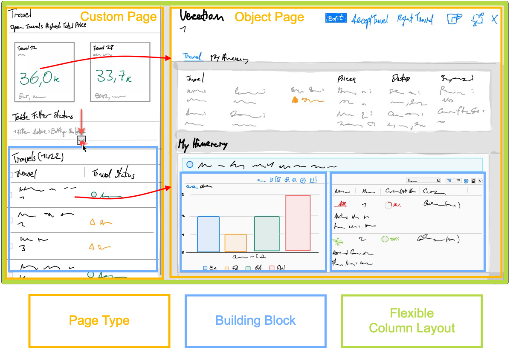

# DT181 - Boost Your Productivity in Developing SAP Fiori Apps 

## Description

This repository contains the material for the SAP TechEd 2022 session called\
**DT181 - Boost Your Productivity in Developing SAP Fiori Apps**.  

## Overview

Welcome to the workshop **DT181 - Boost Your Productivity in Developing SAP Fiori Apps**.\
This workshop will guide you step-by-step through the process of creating a **SAPUI5 custom app** and blending it with the **SAP Fiori Elements Flexible Programming Model** which is available with SAP Fiori elements floorplans for OData V4.\
Based on a **SAP Cloud Application Programming Model** service equipped with basic annotations, you will learn how to assemble your **custom design** from **SAP Fiori Elements Building Blocks** and leverage **Controller Extensions** with the help of **SAP Fiori tools** and the **SAP Fiori Elements Flexible Programming Model**.

# Making a wireframe is a great way to visualize the app

## Requirements

There are no special requirements to follow the exercises in this repository.

## Exercises

- [Getting Started - Setting up your Development Environment](exercises/ex0#getting-started---setting-up-your-development-environment)
  - [Setting Up SAP Business Application Studio](exercises/ex0#setting-up-sap-business-application-studio)
  - [Accessing SAP Business Application Studio](exercises/ex0#accessing-sap-business-application-studio)
  - [Creating the Development Space](exercises/ex0#creating-the-development-space)
  - [Getting the Sample Scenario](exercises/ex0#getting-the-sample-scenario)
- [Exercise 1 - Generating an SAP Fiori Elements App](exercises/ex1/)
    - [Exercise 1.1 - Using the SAP Fiori Tools Application Generator](/exercises/ex1#exercise-11-using-the-sap-fiori-tools-application-generator)
    - [Exercise 1.2 - Starting the App](/exercises/ex1#exercise-12-starting-the-app)
    - [Usage of Guided Answers for Trouble Shooting](/exercises/ex1#usage-of-guided-answers-for-trouble-shooting)
- [Exercise 2 - Flexible Programming Model: Using Fiori Elements Building Blocks on a Custom Page](exercises/ex2#exercise-2---flexible-programming-model-using-fiori-elements-building-blocks-on-a-custom-page)
  - [Exercise 2.1 Guided Development: Adding Filter Bar Building Block](exercises/ex2#exercise-21-guided-development-adding-building-block-filter-bar)
  - [Exercise 2.2 Adding Table Building Block](exercises/ex2#exercise-22-adding-building-block-table)
  - [Exercise 2.3 Page Map: Add Object Page and Switch to Flexible Column Layout](exercises/ex2#exercise-23-page-map-add-object-page-and-switch-to-flexible-column-layout)
- [Exercise 3 - Improve Page Layout and add UI5 Freestyle Controls](/exercises/ex3#exercise-3---improve-page-layout-and-add-ui5-freestyle-controls)
  - [Exercise 3.1 - Adopt Dynamic Page Layout to the Main Page](/exercises/ex3#exercise-31---adopt-dynamic-page-layout-to-the-main-page)
  - [Exercise 3.2 - Add Controller Functions for Setting Filter Status](/exercises/ex3#exercise-32-add-controller-functions-for-setting-filter-status)
  - [Exercise 3.3 - Add Generic Tile Slider](/exercises/ex3#exercise-33---add-generic-tile-slider)
- [Exercise 4 - Page Map: Configuring the Object Page Layout](/exercises/ex4#exercise-4---page-map-configuring-the-object-page-layout)
  - [Exercise 4.1 - Add Actions to Object Page Header](/exercises/ex4#exercise-41---add-actions-to-object-page-header)
  - [Exercise 4.2 - Adding Group and Form Sections](/exercises/ex4#exercise-42---adding-group-and-form-sections)
  - [Exercise 4.3 - Adding a Table Section](/exercises/ex4#exercise-43---adding-a-table-section)
- [Exercise 5 - Page Map: Add Micro Chart Table Column](/exercises/ex5#exercise-5---page-map-add-micro-chart-table-column)
- [Exercise 6 - Flexible Programming Model: Extending the Object Page with a Custom Section and Building Blocks](/exercises/ex6#exercise-6---flexible-programming-model-extending-the-object-page-with-a-custom-section-and-building-blocks)
  - [Exercise 6.1 Remove existing Section via Page Map](/exercises/ex6#exercise-61-remove-existing-section-via-page-map)
  - [Exercise 6.2 Adding a Custom Section via Page Map](/exercises/ex6#exercise-62-adding-a-custom-section-via-page-map)
  - [Exercise 6.3 Replace Generated XML Fragment Content](/exercises/ex6#exercise-63-replace-generated-xml-fragment-content)
  - [Exercise 6.4 Testing the Table Building Block](/exercises/ex6#exercise-64-testing-the-building-block-table)
- [Exercise 7 - Guided Development: Adding Building Block Chart](/exercises/ex7#exercise-7---guided-development-adding-building-block-chart)
  - [Exercise 7.1 - Use Guided Development to Add Building Block Chart](/exercises/ex7#exercise-71---use-guided-development-to-add-building-block-chart)
  - [Exercise 7.3: Implementing the Chart's Selection Change Handler](/exercises/ex7#exercise-73-implementing-the-charts-selection-change-handler)
  - [Exercise 7.4 Testing the Chart's Event Handler](/exercises/ex7#exercise-74-testing-the-charts-event-handler)
- [Exercise 8 - Page Map: Adding a Controller Extension](/exercises/ex8#exercise-8---page-map-adding-a-controller-extension)
	- [Exercise 8.1 - Using the Page Map to Add a Controller Extension](/exercises/ex8#exercise-81---using-the-page-map-to-add-a-controller-extension)
	- [Exercise 8.2 Move XML Fragment to App Folder](/exercises/ex8#exercise-82-move-xml-fragment-to-app-folder)
	- [Exercise 8.3 Testing the Controller Extension](/exercises/ex8#exercise-83-testing-the-controller-extension)

## How to obtain support

Support for the content in this repository is available during the actual time of the online session for which this content has been designed. Otherwise, you may request support via the [Issues](../../issues) tab.

## License
Copyright (c) 2022 SAP SE or an SAP affiliate company. All rights reserved. This project is licensed under the Apache Software License, version 2.0 except as noted otherwise in the [LICENSE](LICENSES/Apache-2.0.txt) file.
