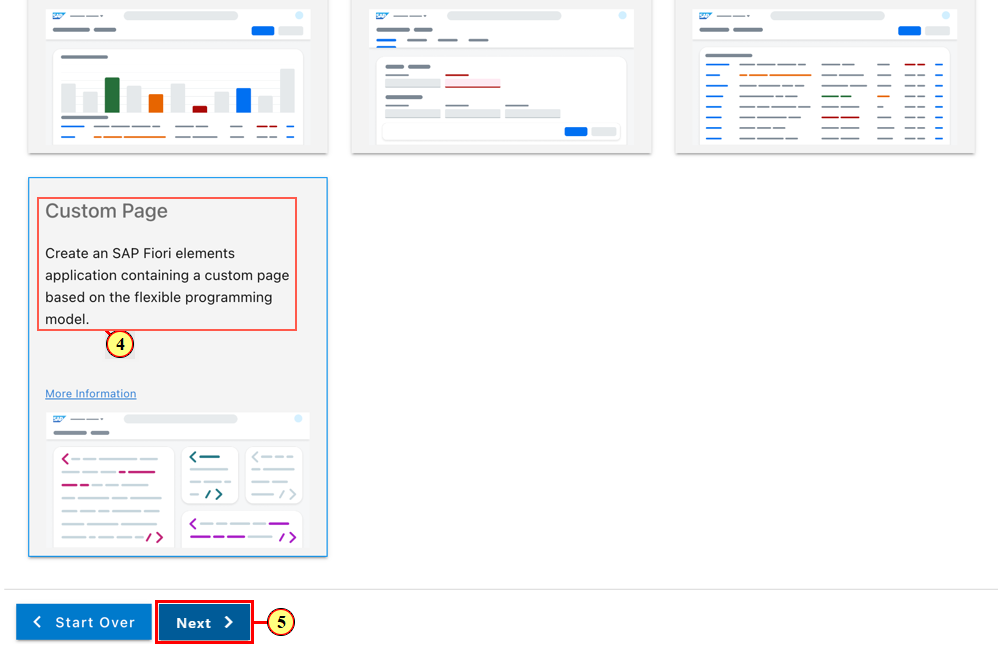
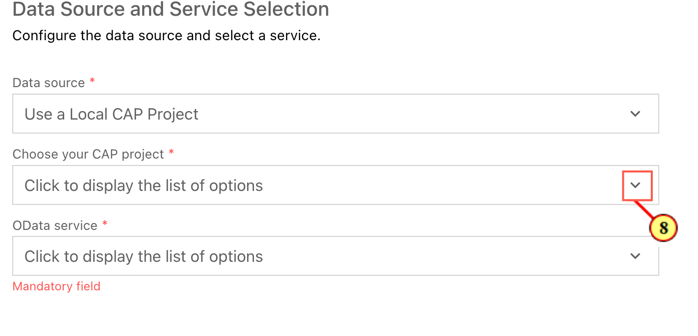
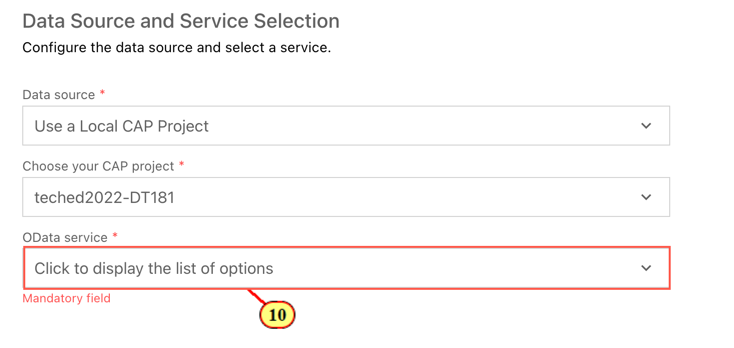

# Exercise 1 - Generating an SAP Fiori Elements App

In this exercise, you will create a **Custom App** application leveraging the **Flexible Programming Model** available with SAP Fiori elements floorplans for OData V4. The scenario is based on the given SAP Cloud Application Programming Model sample service.
To get started,  will make usage of the **SAP Fiori tools Application Generator**.

## Exercise 1.1 Using the SAP Fiori tools Application Generator

In the **SAP Business Application Studio**, the **Welcome page** is shown.

\(1\) Click **Start from template** .

If the Welcome page is not shown, you can start the **Template Wizard** via the Command Palette
(menu View -\>Find Command... or ctrl+shift+p(Win)/cmd+shift+p(Mac))\
In the search field, type **Open Template Wizard**.\
Choose the corresponding list entry.

(2) Click on tile **SAP Fiori application**.

(3) Click **Start**.

(4) In the wizard step **Floorplan Selection**, click on the tile **Flexible Programming Model**.

(5) Click .

(6) In the wizard step **Datasource and Service Selection**, open the dropdown list.

(7)  Select **Use a Local CAP Project**.

(8)  Click the **Browse for folder** icon to select the **CAP project folder path**.

(9) Select folder **teched2022-DT181** and click .

(10) Open the **OData service** dropdown.

(11) Select **TravelService (Node.js)**

(12) Click .

(13)  In the wizard step **Entity Selection**, open drop-down **Main Entity**, and select **Travel.** Click .

In the wizard step **Project Attributes**, add the following attributes to the application project:

- **Module Name**: managetravels\
(module name has to match exactly for some of the subsequent exercises to work properly)

- **Application Title**: Manage Travels\
(or a title by your choice)

- **Application Namespace**: sap.fe.cap\
(namespace has to match exactly for some of the subsequent exercises to work properly)

- **Minimum SAPUI5 version**: Choose version 1.107.0\
 (This is the minimum SAPUI5 version for some of the subsequent exercises to work properly)

(14) Click .

This will start the app generation.\
When finished, you can review the generated artifacts in the **Explorer** pane of SAP Business Application Studio.\
The generated artifacts are located in folder **app/managetravels** (the path reflects the module name you have entered during app generation).\
In folder **app/managetravels/ext/main** you can find the Main.view.xml and corresponding controller that had been created by the app generator.

The custom page is configured as the default starting page in the application manifest routing section. Please note that a custom view in which you want to use building blocks needs to be wrapped into the Flexible Programming Model component provided by SAP Fiori elements. This ensures that the custom page runs on the SAP Fiori elements framework. The context path is required by SAP Fiori elements as a pointer to the metadata.

## Exercise 1.3 Starting the App

After completing these steps you will have started and tested the generated app.

Besides the common way of starting a CAP service via **cds watch**, another convenient way to start the service and app at the same time is to add an npm script with corresponding parametrization to file package.json of the root folder.

In the following exercises, we will extend the app based on xml views and fragments. We need to make sure that the browser view cache is deactivated during testing our development, so that changes applied to the xml fragments get properly updated when refreshing the UI.

Instead of using **cds watch** in the terminal in order to start the service, we will use the watch script that has been added to file **package.json** by the app generator. The script contains additional parameter **sap-ui-xx-viewCache=false** added to the app start Url.\
If **cds watch** is already running in a terminal, please end it by pressing keyboard keys **control+c**, otherwise the default port 4004 will already be in use by the existing server process.

\(15\) Click **Preview Application** on tab **Application information** that is automatically displayed after app generation.

If the tab is closed, you can open it again by selecting the Fiori Tools icon in the side bar and then the application info icon.

This opens a dropdown at the top offering all **cds run** and **cds watch** based scripts maintained in the scripts section of file **package.json**.\
(16) Select npm script **watch-managetravels** 

(17) This runs the service in an Application Modeler terminal session and automatically starts the Fiori application in a new browser session.\
The empty custom app page is shown.

## Summary

You've now successfully generated a SAP Fiori elements application of type Flexible Programming Model.

Continue to - [Exercise 2 - Flexible Programming Model: Using Fiori Elements Building Blocks on a Custom Page](../ex2/README.md)