# Exercise 2 - Flexible Programming Model: Using Fiori Elements Building Blocks on a Custom Page

The available [Fiori elements floorplans](https://help.sap.com/docs/SAP_FIORI_tools/17d50220bcd848aa854c9c182d65b699/2b2b12e708944d85a40d087194cc1edd.html)
for OData V4 cover most business scenarios that customers encounter with SAP. In fact, SAP uses these SAP Fiori elements floorplans to create roughly 80% of new SAP S/4HANA apps.\
If these floorplans do not meet your needs, the flexible programming model provided by SAP Fiori elements
allows to assemble your custom design by combining the available building blocks with SAPUI5 controls,
and leverage controller extensions in order to fine-tune the behaviour of your app.\
Please be aware that when using custom code in your SAP Fiori elements apps,
you will also have to make sure your extensions remain aligned with the evolving SAP Fiori design specification,
whereas the parts generated by annotations will automatically be updated if the standard changes.\
For our scenario, we want to mimic the behaviour of the list report and combine it with some SAPUI5 controls and add some app specific behaviours.
## Exercise 2.1 Guided Development: Adding Building Block Filter Bar

After completing these steps you will have added building blocks filter bar and table to your custom page.

(1) In Business Application Studio, on the Application Info tab Click **Open Guided Development**.

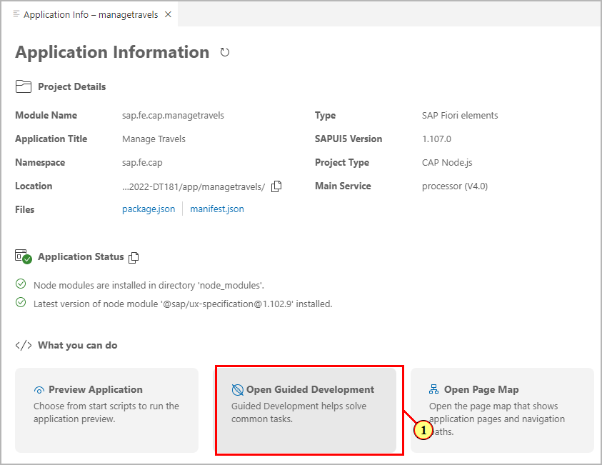

(2) Enter search term **filter bar** in the **Search Guides** field.

(3) Select **Add a filter bar building block**.

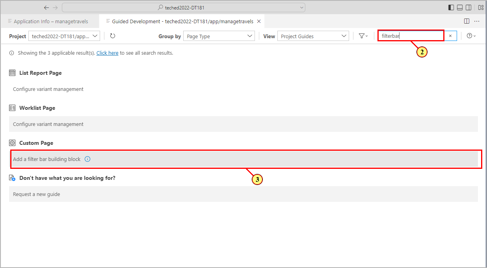

(4) Click .

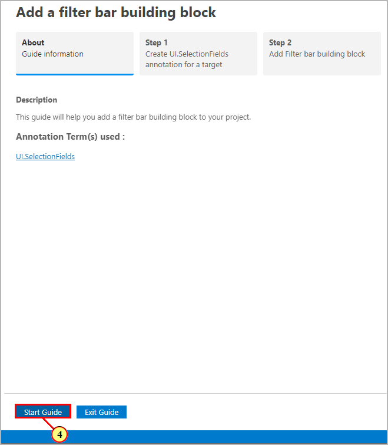

(5) In Step 1 of the dialog, the selection fields to be shown in the filter bar are defined.\
Open drop-down **CDS File** and select the file the annotations are to be inserted into as shown.

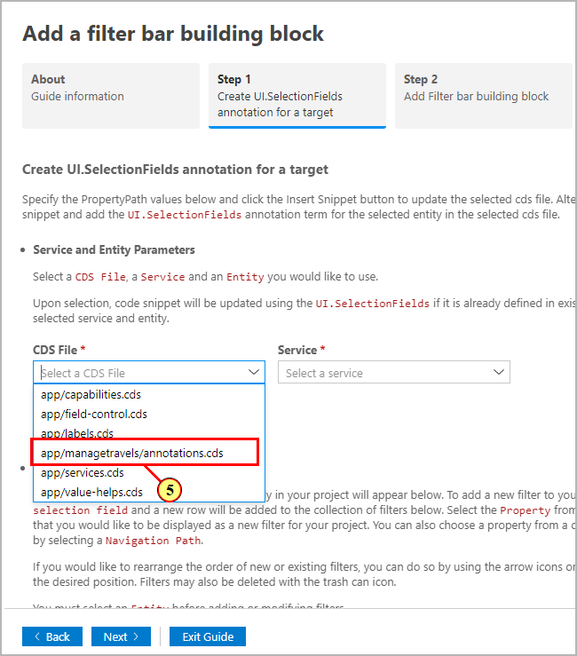

(6) Open drop-down **Service** and select **TravelService**.

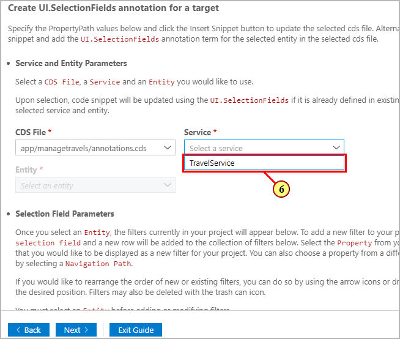

(7) Open drop-down **Entity** and select **Travel**

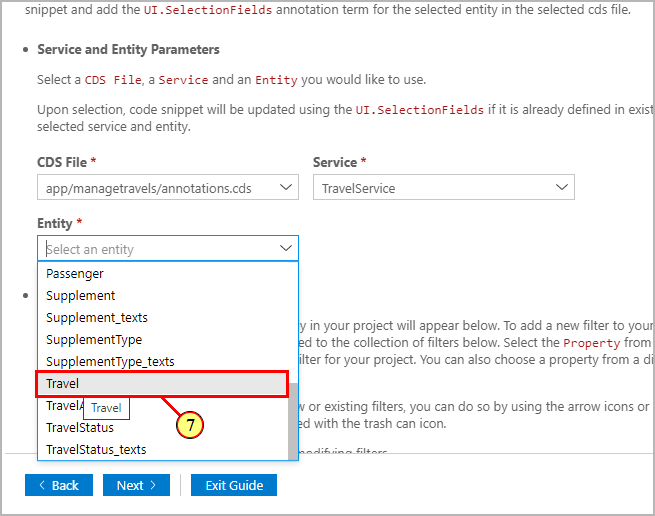

(8) Now let's add some selection fields. We start with **to_Agency_AgencyID**.

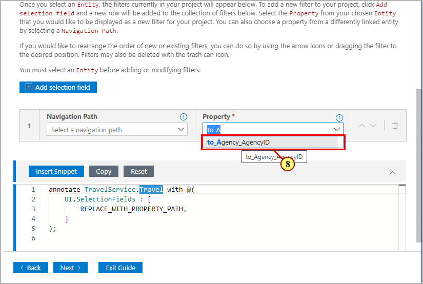

(9) Click  twice.

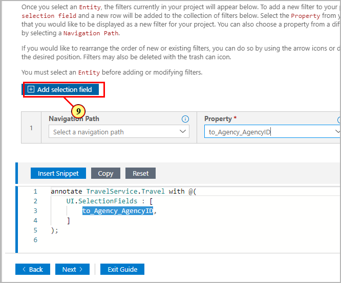

Enter selection fields **to_Customer_CustomerID** (10) and **TravelStatus_code** (11) as shown.

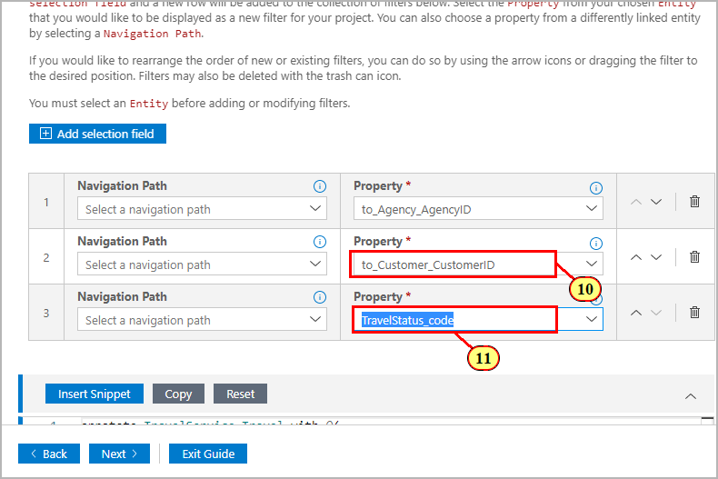

(12) In the annotation preview pane, you can see the generated annotation.\
Clicking  inserts it into the target annotation file.


(13) File **annotations.cds** is opened, showing the inserted annotation.

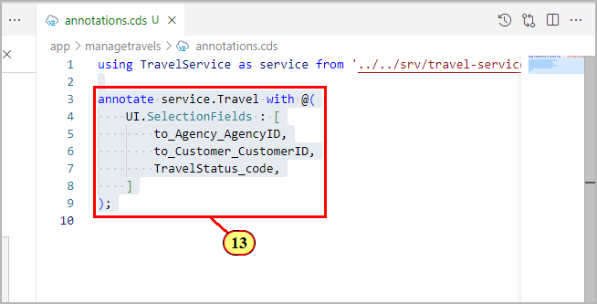

(14) Click **Next** to get to step 2 in the development guide.

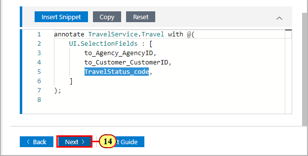

(15) In this step, you will add a filter bar building block to the custom page view.\
Open drop-down **View or Fragment File** and select 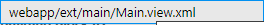.

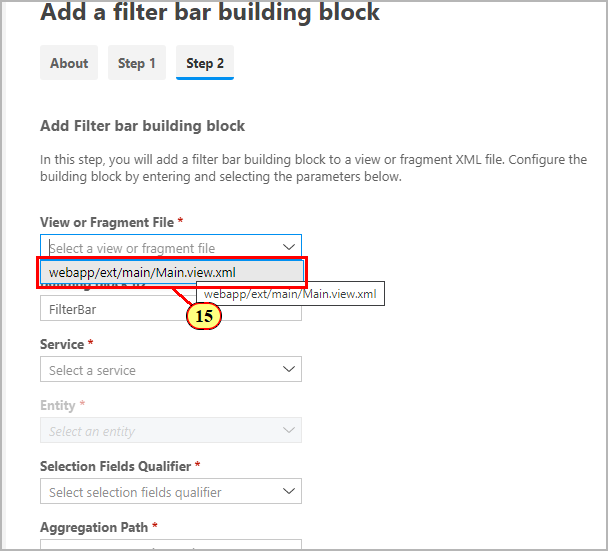

(16) Open drop-down **Service** and select 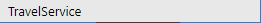.

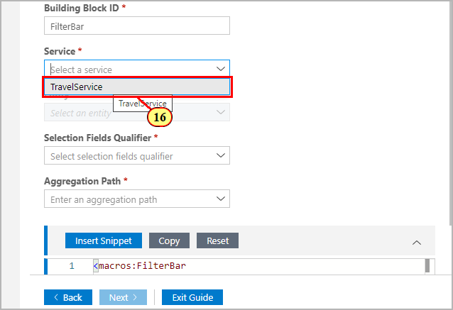

(17) Open drop-down **Entity** and select .

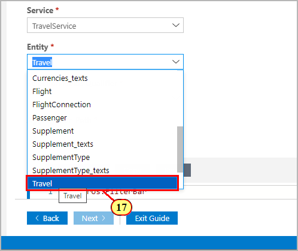

(18) Open drop-down **Selection Fields Qualifier** and select 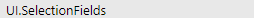.

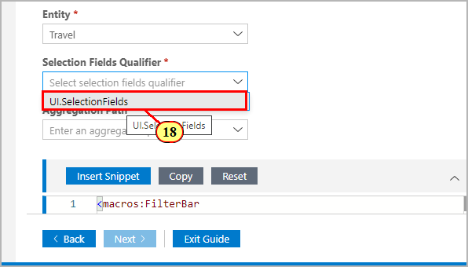

(19) Open drop-down **Aggregation Path** and select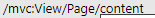.\
The aggregation path points to the location in the xml view where the building block is to be inserted.

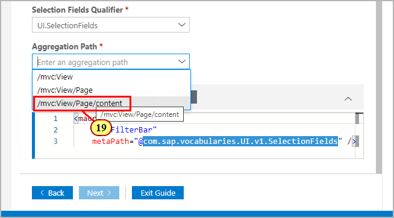

(20) Click 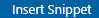.

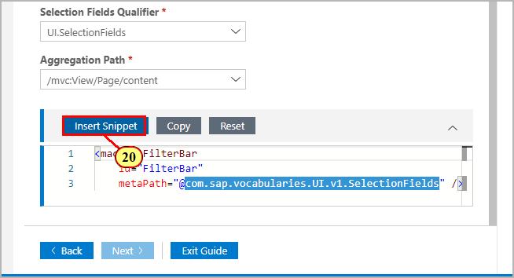

(21) Close the guide by clicking 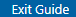.

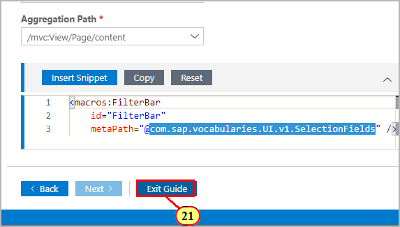

(22) In the opened file **Main.view.xml**, you can see the inserted building block filter bar.\
Please note property **metaPath** referring to the **SelectionFields** annotation that has been inserted in the first step of the guide.

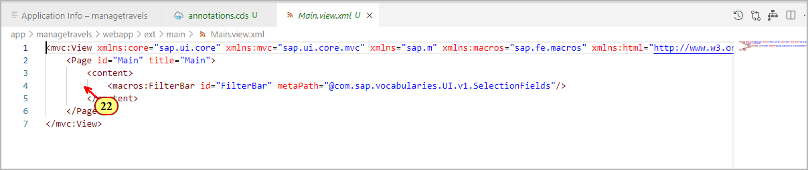

(23) Now let's start the App Preview. Click  in the left toolbar of the Business Application Studio.

(24) Click icon **Preview Application** .

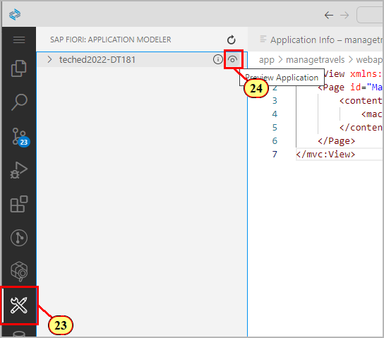

(25) This opens a drop-down on top. Select npm script 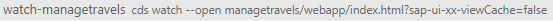.

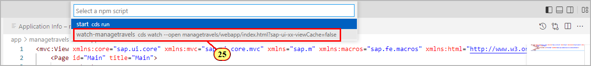

(26) A separate browser tab is opened, showing the filter bar on top. Open a value help to make sure that filter values are shown.\

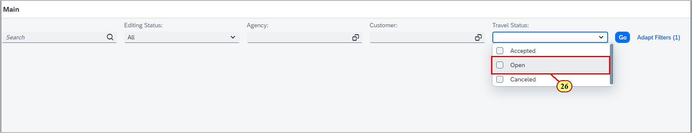

The corresponding value list annotations are provided in the project and can be found in file **app/value-helps.cds**.
## Exercise 2.2 Adding Building Block Table

Now that you've learned how to use guided development in order to add a building block, we will now use CAP CDS LSP support to define the UI.LineItem annotation, access the **Flexible Programming Model Explorer** to check out how to add building block table to the view and semantically connect it to the filter bar.

(27) In the app studio open file **annotations.cds**.

Add a **UI.LineItem** annotation below the existing UI.SelectionFields annotation (separated by a comma).\
You can use the LSP support for annotation modelling by pressing keys ctrl+space (Mac OS: cmd+space) and
filter the available LSP menu entries (choose DataField annotations for normal columns, note that TravelStatus_code has the criticality property defined, and there are two DataFieldForAction annotations).\
Try to create the annotation as shown below, or alternatively just copy over the annotation snippet, and don't forget the comma to separate from the previous annotation:

```js
,
    UI.LineItem  : [
        {
            $Type : 'UI.DataField',
            Value : TravelID,
        },
        {
            $Type : 'UI.DataField',
            Value : TravelStatus_code,
            Criticality : TravelStatus.criticality,
        },
        {
            $Type : 'UI.DataField',
            Value : BeginDate,
        },
        {
            $Type : 'UI.DataField',
            Value : EndDate,
        },
        {
            $Type : 'UI.DataField',
            Value : to_Agency_AgencyID,
        },
        {
            $Type : 'UI.DataField',
            Value : to_Customer_CustomerID,
        },
        {
            $Type : 'UI.DataField',
            Value : TotalPrice,
        },
        {
            $Type : 'UI.DataFieldForAction',
            Label : '{i18n>AcceptTravel}',
            Action : 'TravelService.acceptTravel',
        },
        {
            $Type : 'UI.DataFieldForAction',
            Label : '{i18n>RejectTravel}',
            Action : 'TravelService.rejectTravel',
        },
    ]
```   

(28) The inserted annotation should be located as shown below.

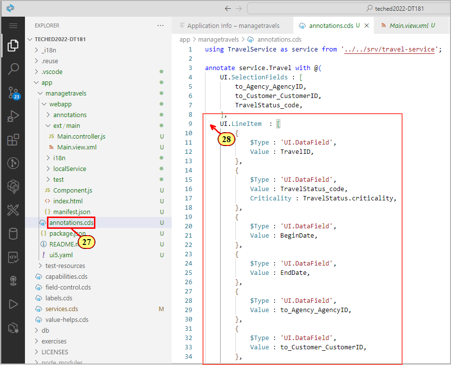

(29) Open table building block sample **Usage with Filter Bar** in the [Flexible Programming Model Explorer](https://ui5.sap.com/test-resources/sap/fe/core/fpmExplorer/index.html#/buildingBlocks/table/tableFilterBar).\
Here you can get some hands-on a live sample and check out the underlying code on the right side of the Explorer.\
The code snippets can be manipulated, resulting in an instant reload of the sample.

(30) The code snippet shows that building blocks filter bar and table are semantically connected via the filter bar ID. In the code editor, select and copy the **macros:table** definition.

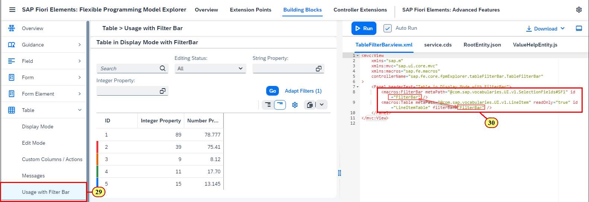

(31) In the application studio, open file 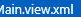. Per default, this opens the page layout editor.\
For our scenario, we require the classic XML text editor.

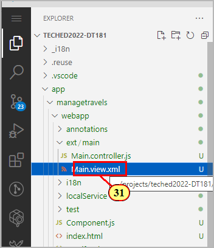

(32) To switch to the XML text editor, click file **Main.view.xml** with the right mouse button and select .

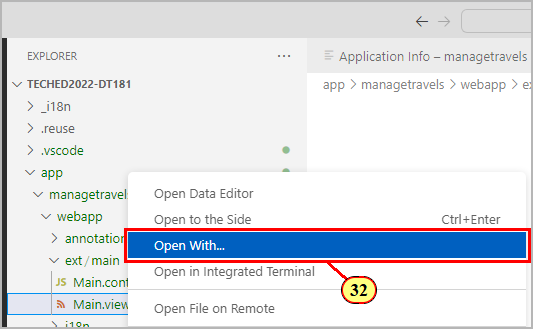

(33) In the drop-down that opens on top, select 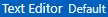.

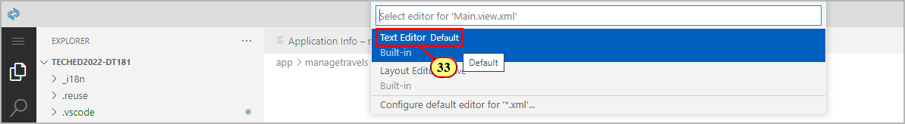

(34) Insert an empty line below **macros:FilterBar** and insert the copied **macros:Table** line.

```js
<macros:Table metaPath="@com.sap.vocabularies.UI.v1.LineItem" readOnly="true" id="LineItemTable" filterBar="FilterBar" />
```
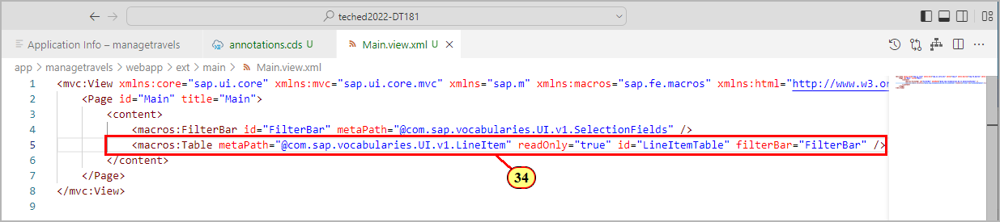
## Exercise 2.3 Page Map: Add Object Page and Switch to Flexible Column Layout

In this exercise we will add an object page to check on the navigation capabilities of the building block table.\
We will then switch the page layout to flexible column layout. The flexible column layout allows users to see more\
details on the page, and to expand and collapse the screen areas.

(35) Open the **Page Map** from the Application Info tab.

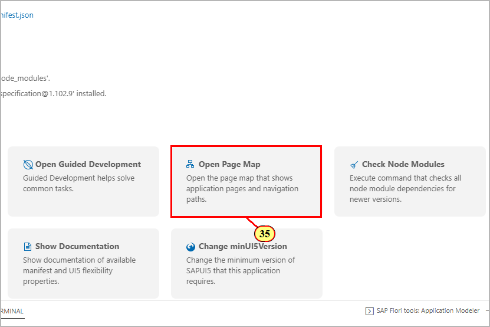

(36) Click **Add New Page** .

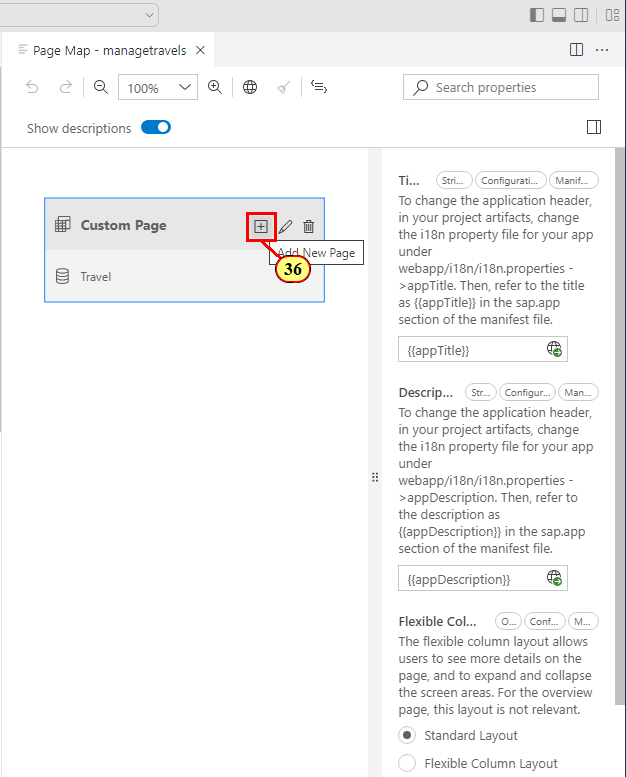

(37) On the **Add Page** dialog, open the drop-down of field **Navigation** and Select **Travel (Travel)**.
This defines the context binding of the object page and\
automatically enables navigation for the custom page table.

(38) Click .


(39) Enable **Flexible Column Layout** by selecting the corresponding radio button.

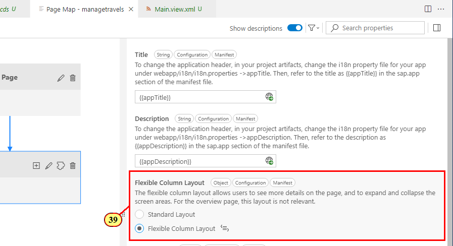

(40) For **Select Layout for 2 Columns**, select **Mid-Expanded**

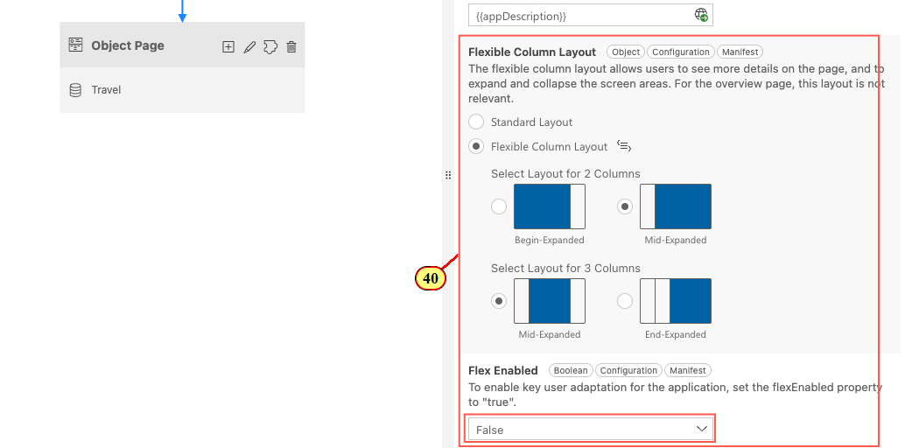

As the object page is yet empty, we will define a title and description.\
(41) Click icon **Configure Page** .

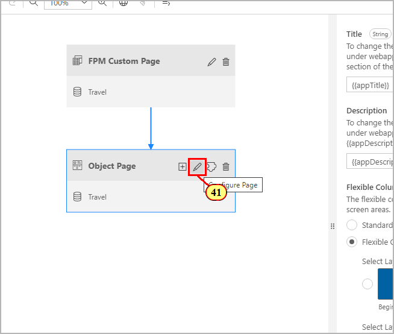

(42) Click on **Header**.

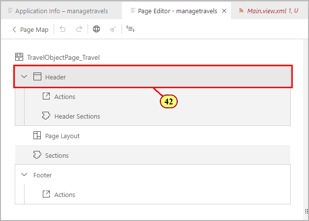

(43) Enter **Travel** in field **Type Name** and click the text key icon .\
This substitutes the String with a translatable text key in the app's i18n file.

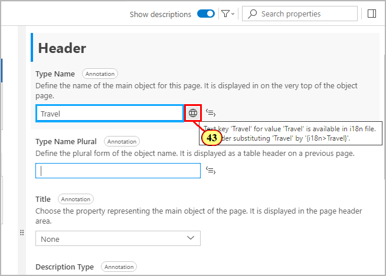

(44)  Confirm the dialog by clicking 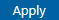.

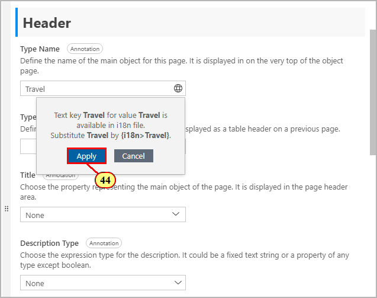

(45) Enter **Travels** in field **Type Name Plural** and create
another text key for it.

(46) Open drop-down field for **Title** and select property **Description**.


(47) Open the drop-down for field **Description Type** and select **Property**.

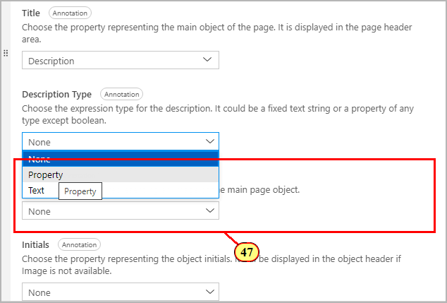

(48) In the **Define Property** dialog, open the drop-down for field **Description** and select **TravelID**.

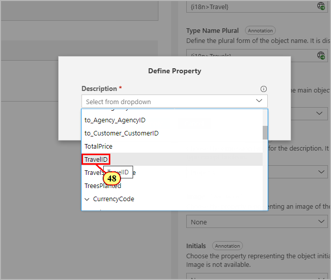

(49) Confirm by clicking button .

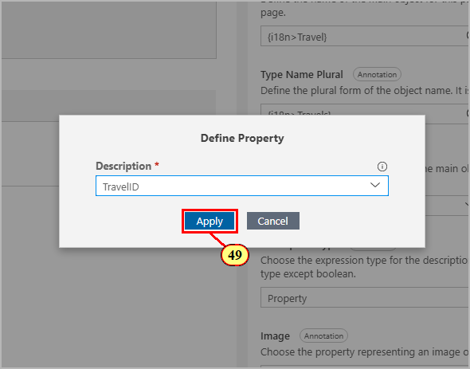


Switch back to the preview browser tab. It is now showing the filter bar and the table. Use the selection fields and trigger selection with **Go** to test the connection between both building blocks.\
(50) Click on a table line to navigate to the object page. By using building block table, navigation works solely through the context path without having to apply any additional custom coding.


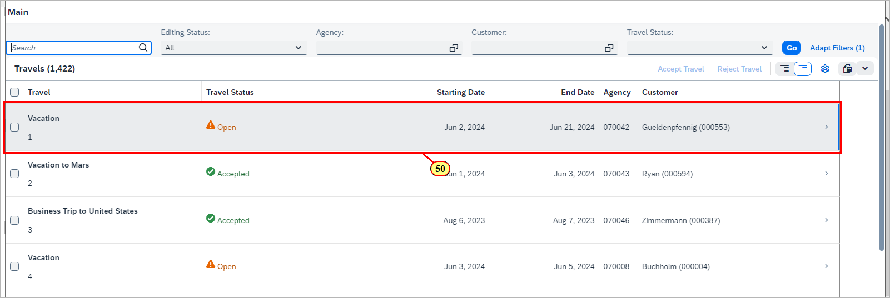

The pages are shown in the flexible column layout. You can use the **expand/collapse** buttons in to upper right corner to change the layout of the screen areas.\
The configured travel description and travel ID are shown in the object page header.

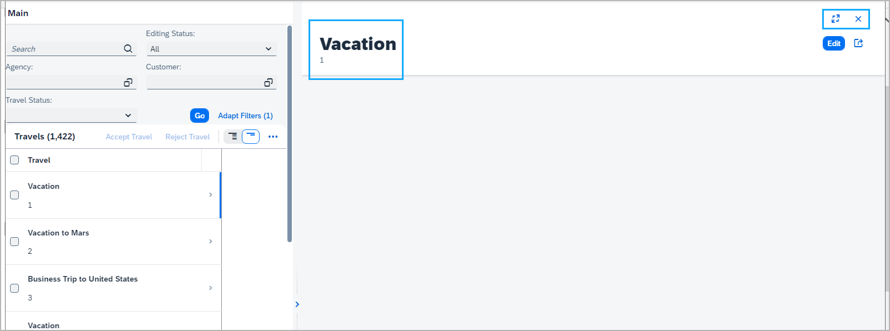
## Summary

You've now successfully added building blocks filter bar and table to a custom view.

Continue to - [Exercise 3 - Improve Page Layout and add UI5 Freestyle Controls ](../ex3/README.md)
