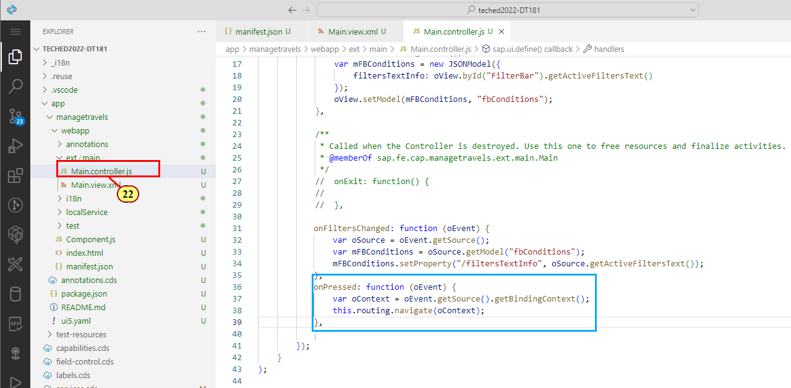

# Exercise 3 - Improve Page Layout and add UI5 Freestyle Controls

In this exercise we will improve the page layout and add features like a dynamic page title with snapped header content showing the filter status as it is known from the standard Listreport floorplan.\
In order to adopt a custom design proposal, we will then add a tile slider showing open travels with a high total price.
## Exercise 3.1 - Adopt Dynamic Page Layout to the Main Page

(1) Open the [filter bar sample](https://ui5.sap.com/test-resources/sap/fe/core/fpmExplorer/index.html#/buildingBlocks/filterBar/filterBarDefault) in the Flexible Programming Model Explorer

The sample shows the building block filter bar in a dynamic page layout.\
(2) Click the **Collapse Header** icon  to see the filter status.


Take a look at the code pane on the right side.

(3) The filter bar status is defined in the snapped content of the dynamic page title with a declarative binding to property **fbConditions>/filterTextInfo**.

(4) The Filter bar building block is defined in the dynamic page header.


We apply the adopted code snippet to our main view.
Switch back to the Business Application Studio and open file **main.view.xml**.

(5) Add a declaration to the sap.f library to the header.

(6) Replace the whole \<Page> section with the adopted code snippet:

```xml
    <f:DynamicPage id="FilterBarDefault" class="sapUiResponsiveContentPadding">
        <f:title>
            <f:DynamicPageTitle id="_IDGenDynamicPageTitle1">
                <f:heading>
                    <Title id="_IDGenTitle1" text="Travel" level="H2" />
                </f:heading>
                <f:snappedContent>
                    <Panel headerText="{i18n>FilterStatus}">
                        <Text text="{fbConditions>/filtersTextInfo}" class="sapUiTinyMargin" />
                    </Panel>
                </f:snappedContent>
            </f:DynamicPageTitle>
        </f:title>
        <f:header>
            <f:DynamicPageHeader id="_IDGenDynamicPageHeader1" pinnable="true">
                <VBox id="_IDGenVBox1">
                    <macros:FilterBar 
                        metaPath="@com.sap.vocabularies.UI.v1.SelectionFields" 
                        id="FilterBar" 
                        filterChanged=".handlers.onFiltersChanged" />
                </VBox>
            </f:DynamicPageHeader>
        </f:header>
        <f:content>
            <macros:Table 
            id="myTable" 
            filterBar="FilterBar" 
            metaPath="@com.sap.vocabularies.UI.v1.LineItem" />
        </f:content>
    </f:DynamicPage>
```


Please note that the table building block is located in the dynamic page content section.

## Exercise 3.2 Add Controller Functions for Setting Filter Status

We now need to adopt some controller code from the sample for setting the filter status value and for the filter changed event handler.\
Switch back to the Flexible Programming Model Explorer. In the code editor, open file **FilterBarDefault.controller.js**.

(7) Function **onAfterRendering** creates a JSONModel with property **filtersTextInfo** (and some others needed for the sample).\
The value is retrieved by FilterBar API function **getActiveFiltersText()**.

(8) In event handler function **onFiltersChanged**, property **filterTextInfo** is set every time the filter has been changed.


To leverage that functionality in the app, we adopt the sample code to file **app/managetravels/webapp/Main.controller.js**.

(9) Switch back to the Application Studio and open file **Main.controller.js**

(10) Add ```sap/ui/model/json/JSONModel``` to the sap.ui.define
section.

(11) Add ```JSONModel``` as import parameter to the page controller function.

(12) Replace function **onAfterRendering** with the following code snippet:
```js
             onAfterRendering: function (oEvent) {
				var oView = this.getView();
				var mFBConditions = new JSONModel({
					filtersTextInfo: oView.byId("FilterBar").getActiveFiltersText()
				});
				oView.setModel(mFBConditions, "fbConditions");
			},
```
(13) Add the following wrapped handler function **onFiltersChanged** as shown in the screenshot.
```js
            handlers: {
				onFiltersChanged: function (oEvent) {
					var oSource = oEvent.getSource();
					var mFBConditions = oSource.getModel("fbConditions");
					mFBConditions.setProperty("/filtersTextInfo", oSource.getActiveFiltersText());
				}             
			}
```


Switch to the preview browser tab.

(14) Click Collapse Header Icon.

(15) The filter status is shown in the snapped header area.


## Exercise 3.3 - Add Generic Tile Slider

The target design of the app sketches an overview on open travels with a high total price in form of a tile slider in the custom page snapped header area. While this could be as well achieved by defining multiple tab views with a selection variant on a standard list report (and it is recommended to always evaluate what can be achieved with the standard means Fiori elements offers), customers might prefer an alternative design approach to meet their requirements, which can be achieved with the Flexible Programming Model.

(16) Open the [Custom Page Sample](https://ui5.sap.com/test-resources/sap/fe/core/fpmExplorer/index.html#/customElements/customElementsOverview/customPageContent) in the **Flexible Programming Model Explorer**.

(17) Click on a tile to navigate to a Fiori elements object page.


(18) Select **CustomPage.view.xml** in the code pane. It shows the GenericTile definition with declarative property binding and a press handler.


(19) Select **CustomPage.controller.js**. The press handler implementation shows how navigation is done by using the Flexible Programming Model routing extension API by simply passing the binding context to function **navigate**.


Switch back to the Application Studio.\
(20) Open file **app/managetravels/webapp/i18n.properties** and add the following text keys :

```js
HighestPrice=Open Travels Highest Total Price (Thousands)

FilterStatus=Table Filter Status
```


(21) Switch to file **Main.view.xml**. Replace the code in \<f:snappedContent\> with the following:

```xml
<Panel id='pn1' headerText='{i18n>HighestPrice}'>
    <VBox id='vb1'>
        <HeaderContainer scrollStep="200" id="container1" content="{
            path:'/Travel', 
            parameters : {
                $filter : 'TravelStatus_code eq \'O\' and IsActiveEntity eq false or SiblingEntity/IsActiveEntity eq null',
                $orderby : 'TotalPrice desc'
            }
        }">
            <GenericTile id='gt1' header="Travel {TravelID}" subheader="{Description}" press=".handlers.onPressed" class="sapUiTinyMarginEnd sapUiTinyMarginTop tileLayout">
                <TileContent id='tc1' unit="{CurrencyCode_code}" footer="{to_Customer/LastName}">
                    <NumericContent id='nc1' withMargin="false" value="{TotalPrice}" valueColor="Good" scale="k" />
                </TileContent>
            </GenericTile>
        </HeaderContainer>
    </VBox>
</Panel>
<Panel id='pn2' headerText="{i18n>FilterStatus}">
    <Text id='filterInfo1' text="{fbConditions>/filtersTextInfo}" class="sapUiTinyMargin" />
</Panel>
```


Please note the filter parameter operating on the draft administrative properties. This will make sure that values are updated from draft instances every time a travel is edited on the object page.

(22) Open file **Main.controller.js** and add the handler function for the **onPressed** event.

```js
,
onPressed: function (oEvent) {
    var oContext = oEvent.getSource().getBindingContext();
    this.routing.navigate(oContext);
}
```



(23) Switch to the app preview browser tab. Click the collapse header icon or scroll the table to show the tiles. Click on a tile to navigate to the object page.


We will add a custom slider filter allowing to narrow down the shown Travel tiles based on a minimum total price.

(24) Open file **Main.view.xml** and the following snippet as shown below.
```js
<Slider id='sl1' 
    enableTickmarks="true" 
    showAdvancedTooltip="true" 
    change=".handlers.onSliderChanged" 
    value="0" 
    min="0" 
    max="30" 
    width="40%" 
    class="sapUiMediumMarginBottom" 
/>
```


(25) Add the **onSliderChanged** handler to file Main.controller.js. You need to additionally define 'sap/ui/model/Filter' and the corresponding import parameter to the page controller function. the function sets an updated filter on property TotalPrice every time the slider is moved.
```js
,
onSliderChanged: function (oEvent) {
    this._aStatusFilters = [];
    var oBinding = this.getView().byId("container1").getBinding("content"),
    sValue = oEvent.getParameter("value") * 1000;
    this._aStatusFilters = [new Filter("TotalPrice", "GE", sValue, false)];
    oBinding.filter(this._aStatusFilters)

}  
```


Switch to the app preview browser tab.\
(26) With the header collapsed, click and move icon  on the slider. When releasing it, the tiles are updated.


## Summary

You've now successfully adopted dynamic page layout to your main view and added filter status text to the snappe header area.

Continue to - [Exercise 4 - Page Map: Configuring the Object Page Layout](../ex4/README.md)