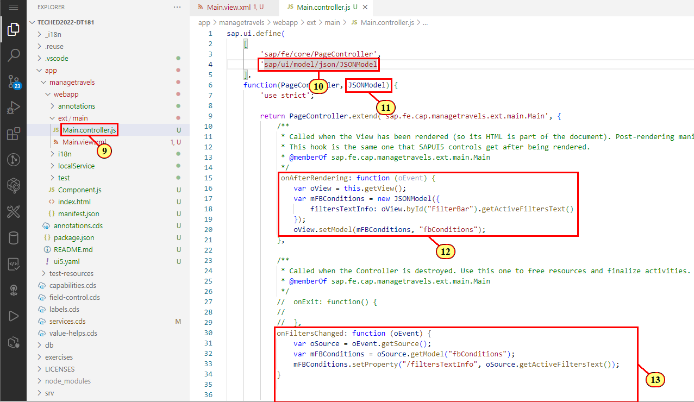

# Exercise 3 - Improve Page Layout and add UI5 Freestyle Controls

In this exercise we will improve the page layout and add features like a dynamic page title with snapped header content showing the filter status\
as it is known from the standard Listreport floorplan.
In order to adopt a custom design proposal, we will then add a tile slider showing open travels with a high total price.\

## Exercise 3.1 - Adopt Dynamic Page Layout to the Main Page

(1) Open the [filter bar sample](https://ui5.sap.com/test-resources/sap/fe/core/fpmExplorer/index.html#/buildingBlocks/filterBar/filterBarDefault) in the Flexible Programming Model Explorer

The sample shows the building block filter bar in a dynamic page layout.\
(2) Click the **Collapse Header** icon  to see the filter status.


Take a look at the code pane on the right side.

(3) The filter bar status is defined in the snapped content of the dynamic page title with a declarative binding to property **filterTextInfo**.

(4) The Filter bar building block is defined in the dynamic page header.


We apply the adopted code snippet to our main view.
Switch back to the Business Application Studio and open file **main.view.xml**.\

(5) Add a declaration to the sap.f library to the header.

(6) Replace the whole \<Page> section with the adopted code snippet:

```xml
    <f:DynamicPage id="FilterBarDefault" class="sapUiResponsiveContentPadding">
        <f:title>
            <f:DynamicPageTitle id="_IDGenDynamicPageTitle1">
                <f:heading>
                    <Title id="_IDGenTitle1" text="Travel" level="H2" />
                </f:heading>
                <f:snappedContent>
                    <Panel headerText="{i18n>FilterStatus}">
                        <Text text="{fbConditions>/filtersTextInfo}" class="sapUiTinyMargin" />
                    </Panel>
                </f:snappedContent>
            </f:DynamicPageTitle>
        </f:title>
        <f:header>
            <f:DynamicPageHeader id="_IDGenDynamicPageHeader1" pinnable="true">
                <VBox id="_IDGenVBox1">
                    <macros:FilterBar 
                        metaPath="@com.sap.vocabularies.UI.v1.SelectionFields" 
                        id="FilterBar" 
                        filterChanged=".handlers.onFiltersChanged" />
                </VBox>
            </f:DynamicPageHeader>
        </f:header>
        <f:content>
            <macros:Table 
            id="myTable" 
            filterBar="FilterBar" 
            metaPath="@com.sap.vocabularies.UI.v1.LineItem" />
        </f:content>
    </f:DynamicPage>
```


Please note that the table building block is located in the dynamic page content section.\

We now need to adopt some controller code from the sample for setting the filter status value and for the filter changed event handler.\
Switch back to the Flexible Programming Model Explorer. In the code editor, open file **FilterBarDefault.controller.js**.

(7) Function **onAfterRendering** creates a JSONModel with property **filtersTextInfo** (and some others needed for the sample).\
The value is retrieved by FilterBar API function **getActiveFiltersText().

(8) In event handler function **onFiltersChanged**, **filterTextInfo** is set every time the filter has been changed.


To leverage that functionality in the app, we adopt the sample code to file app/managetravels/webapp/Main.controller.js.

(9) Switch back to the Application Studio and open file **Main.controller.js**

(10) Add ```sap/ui/model/json/JSONModel``` to the sap.ui.define
section.

(11) Add ```JSONModel``` as import parameter to the page controller function.

(12) Replace function **onAfterRendering** with the following code snippet:
```js
             onAfterRendering: function (oEvent) {
				var oView = this.getView();
				var mFBConditions = new JSONModel({
					filtersTextInfo: oView.byId("FilterBar").getActiveFiltersText()
				});
				oView.setModel(mFBConditions, "fbConditions");
			},
```
(13) Add the following wrapped handler function **onFiltersChanged** as shown in the screenshot.
```js
            handlers: {
				onFiltersChanged: function (oEvent) {
					var oSource = oEvent.getSource();
					var mFBConditions = oSource.getModel("fbConditions");
					mFBConditions.setProperty("/filtersTextInfo", oSource.getActiveFiltersText());
				}             
			}
```


Switch to the preview browser tab.

(14) Click Collapse Header Icon.

(15) The filter status is shown in the snapped header area.


## Summary

You've now successfully adopted dynamic page layout to your main view and added filter status text to the snappe header area.

Continue to - [Exercise 4 - ](../ex3/README.md)
