# Exercise 4 - Page Map: Configuring the Object Page Layout 

In this exercise we will configure the object page layout by using the Fiori tools Page Map.

## Exercise 4.1 - Add Actions to Object Page Header

(1) In the Application Studio toolbar, click the SAP Fiori icon .

(2) Click icon **Open Application Info** .

(3) Click on tile **Open Page Map**.

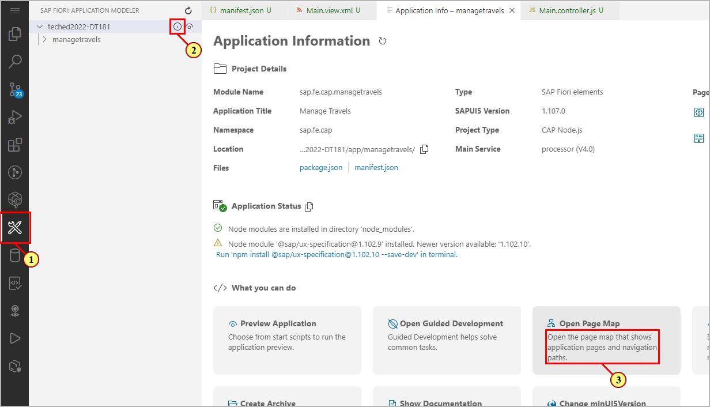

(4) Open the object page configuration by clicking button **Configure Page** .

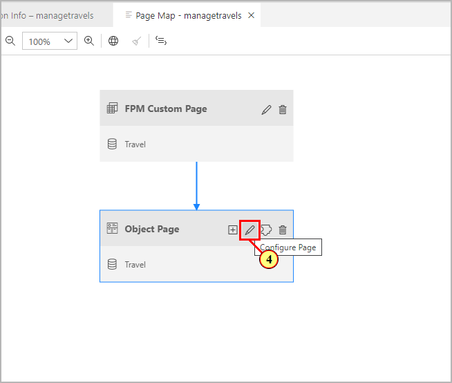

We start by defining some actions in the object page header.

(5) Click **Add Actions** .

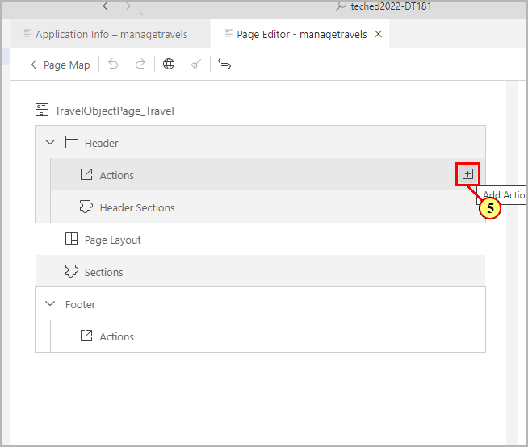

(6) In the **Add Actions** dialog, open the drop-down and (7) select actions **AcceptTravel** and **RejectTravel**.

(7) confirm by clicking 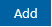.

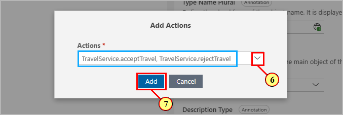

Define a text to be displayed as a action button label by entering (8) **Accept Travel** and (9) **Reject Travel**. 

(10) Click **Create missing i18n references**  to create the corresponding text keys.

(11) Confirm by clicking button 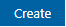. The whole project is scanned for missing text key references.

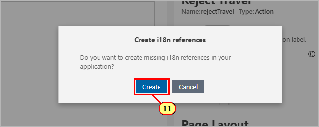

The popover informs about the number of missing text keys that were created.

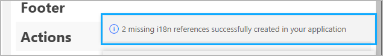
## Exercise 3.1 - Adding Group and Form Sections

In this exercise we will add a group section and several form sub sections. 

(12) Clicking button **Add Sections ** and select
(13) .

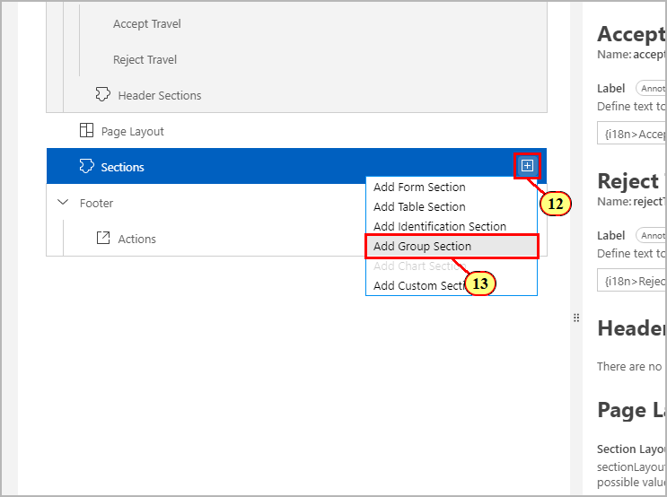

(14) In the **Add Group Section** dialog, enter label **Travel** and create the corresponding text key reference by clicking button .

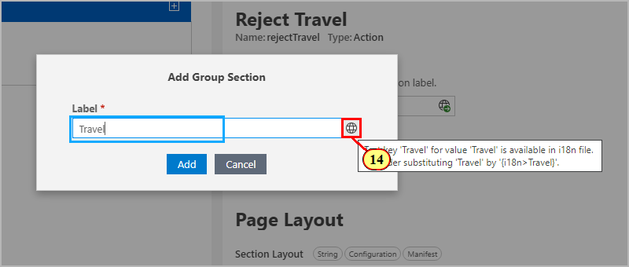

(15) Confirm by clicking button .

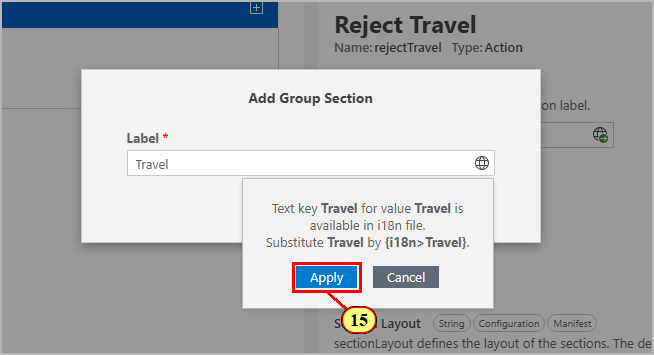

(16) Click .

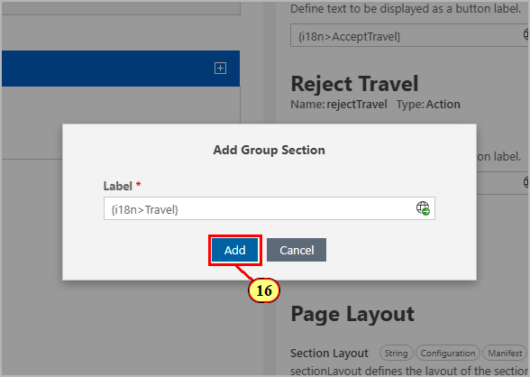

(17) Expand section **Travel** by clicking .

(18) Click **Add Sections ** to add a sub section.

(19) Select .

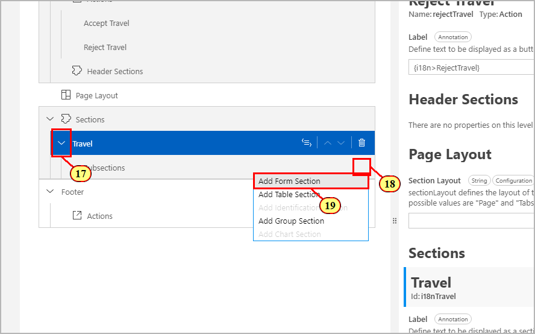

(20) Enter label **Travel** and click .

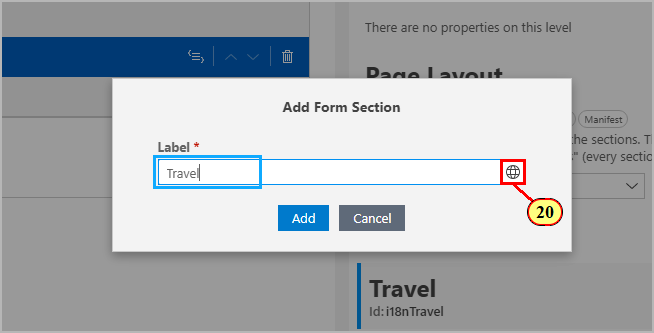

(21) Click 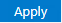.

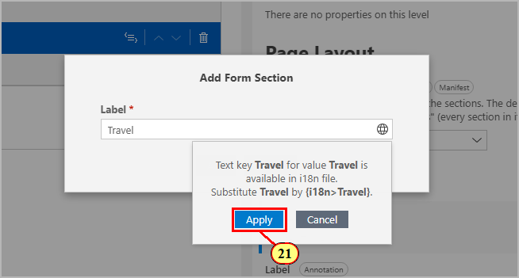

(22) Click .

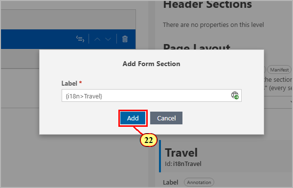

(23) (24) Expand the sub section hierarchy,  (25) Click  and (26) select .

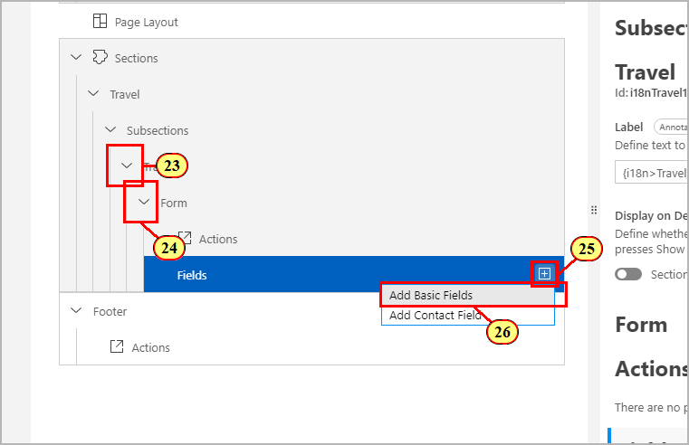

(27) In the **Add Basic Fields** dialog, open the drop-down and select field **TravelID**. you can use the input field for filtering the available properties. Remove the filter quickly by pressing keys Ctrl+A(Mac: Cmd+A) then DEL. The selected properties are kept.

(28) Click ** **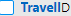.

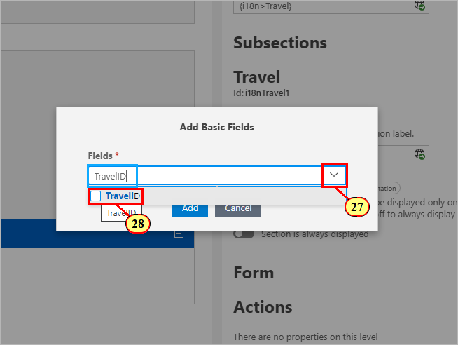

(29) Add 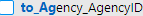.

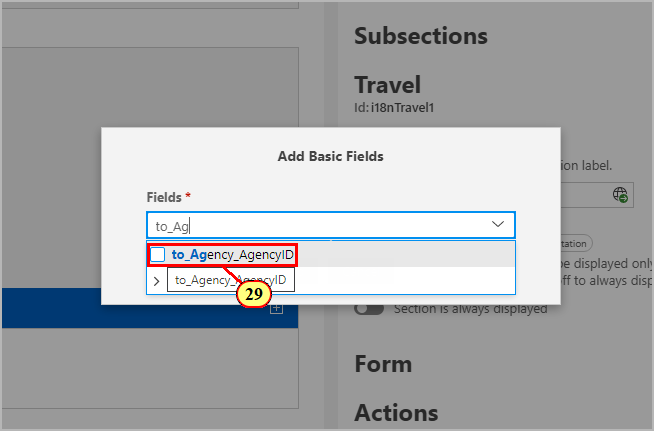

(30) Add 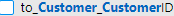.

(31) Add 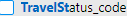.

(32) To collapse the drop-down, click somewhere in the dialog .

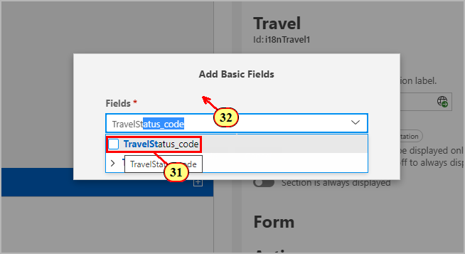

(33) Click .

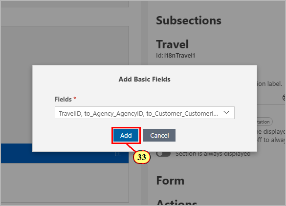

(34) (35) Add additonal sub sections of type **Form**:

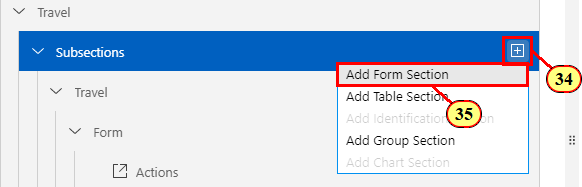

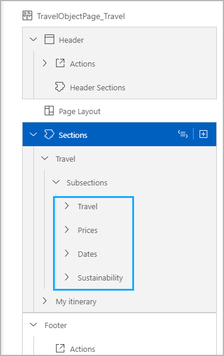

Add the following properties to the sections:

|     Sub Section             |     Property                
|-----------------------------|-----------------------------
|     Prices                  |     
|                             |     BookingFee                            
|                             |     TotalPrice
|     Dates                   |
|                             |     BeginDate
|                             |     EndDate
|     Sustainability          |
|                             |     GoGreen
|                             |     GreenFee
|                             |     TreesPlanted

Swich to the preview browser tab.
(36) Select one travel to open the object page .

The Travel tiles show travels with status open.\
(37) Clicking action button  changes the travel status.\
A side effect defined on the action in file **app/field-control.cds** [line 26 ff.](/app/field-control.cds#26) makes sure that the Travel entity is refreshed when the action is executed. Check that the current selected Travel tile dissappears.\
For more information about side effects, please check the guide [Usage of Side Effects](https://sapui5.hana.ondemand.com/test-resources/sap/fe/core/fpmExplorer/index.html#/advancedFeatures/guidance/guidanceSideEffects).

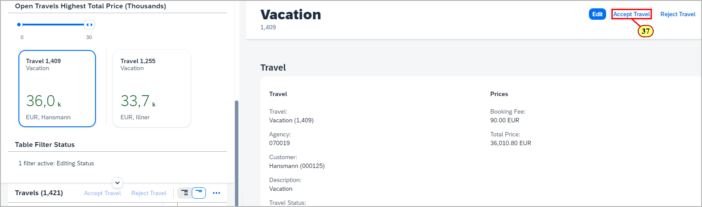

(38) Select another travel.

(39) Click .

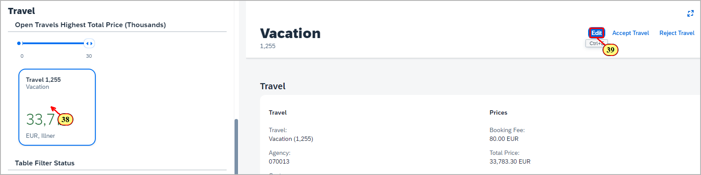

(40) Select the **Trees-4-Tickets** checkbox.\
For a sustainability initiative, the travel service provides some fields for a new green flight offering.\
When the checkbox is selected, an info popover is shown (41), and the service backend calculates the values for properties Green Flight Fee,Trees Planted, and Total Price.\
The values shown on the UI are automatically updated by another side effect on property **GoGreen** of entity **Travel**
defined in file **app/field-control.cds** [line 86 ff.](/app/field-control.cds#86)

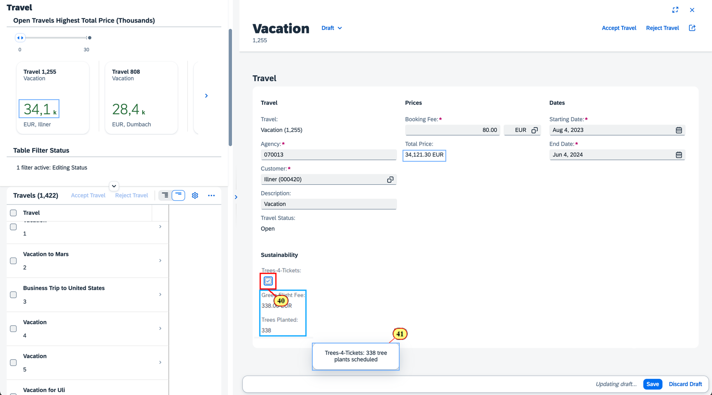

## Exercise 4.2 - Adding a Table Section

Let's add a table section by using the Page Map.

(42) Click **Add Sections**.

(43) Select **Add Table Section**.

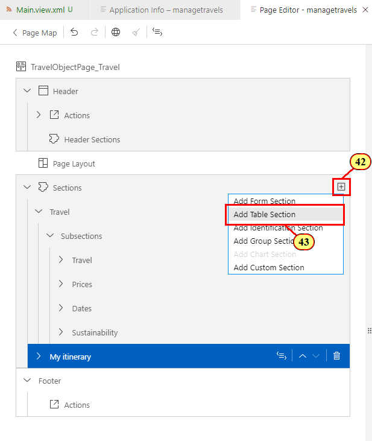

(44) Enter **My Itinerary** as label and create a text key for it by clicking .\
(45) Confirm dialog with 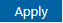.

(46) Open drop-down **Value Source** and select **to_Booking**.

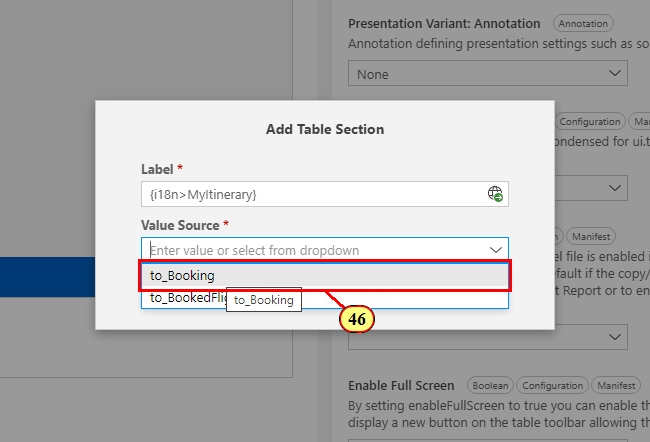

(47) Click **Add**.

(48) (49) Expand the section hierarchy.

(50) Clicki button **Add Columns **.

(51) Select .

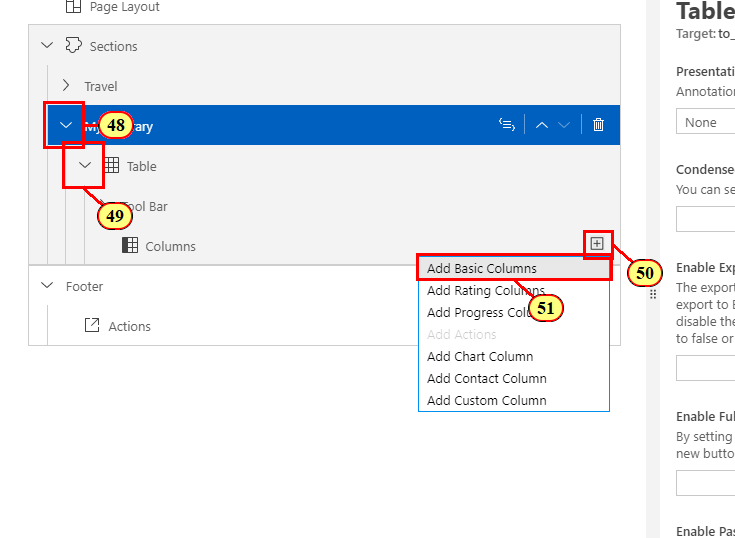

(52) In dialog **Add Basic Columns**, open the drop-down and select the following properties:

- to_Carrier.AirlinePicUrl
- BookingID
- to_Customer_CustomerID
- to_Carrier_AirlineID
- ConnectionID
- FlightDate
- FlightPrice
- BookingStatus_code

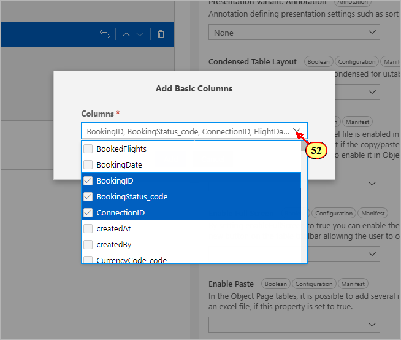

(53) Click .

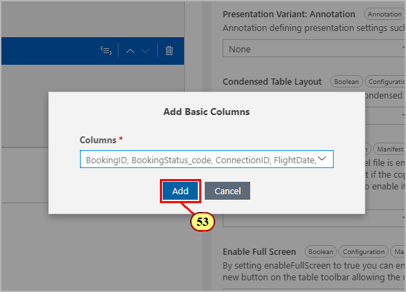

If not in the right order, you can rearrange the columns by (54)dragging and (55) dropping the columns.

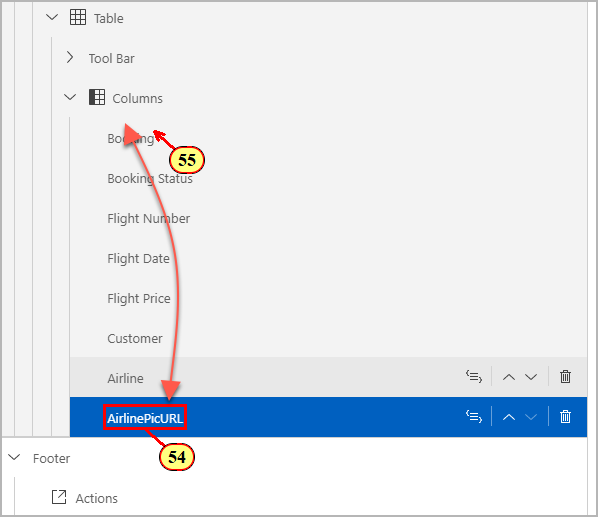

Please note that in the Page Map you can always navigate to the corresponding annotation by clicking button 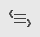.

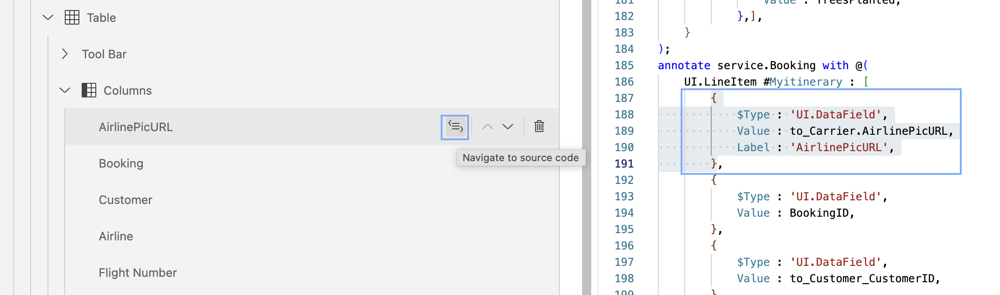

Switch to the preview browser tab.\
(56) On the object page, Click **Enter Full Screen** .

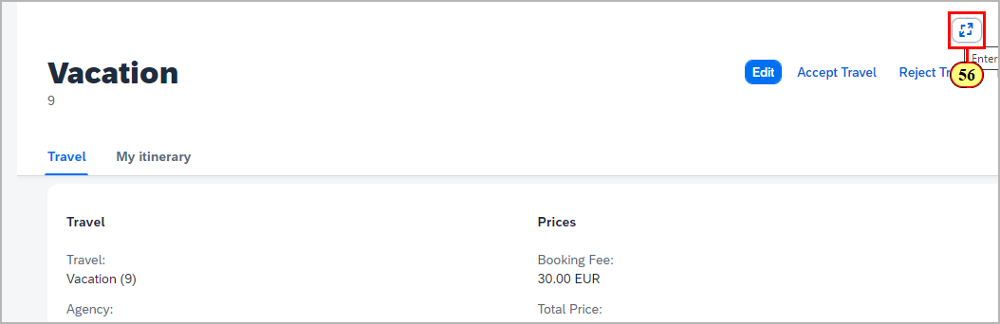

The table is shown below the group section.

## Summary

You've now successfully configured the object page layout by adding group section,  sub sections, and a table section by making usage of the Page Map.

Continue to - [Exercise 5 - Add Table Line Criticality and Micro Chart Table Column](../exy/README.md)