# Exercise 5 - Page Map: Add Micro Chart Table Column

In this exercise we will add a table column of type **micro chart** by using the Page Map.\
The micro chart shall show the Customer VIP Status per booking, based on all cumulated bookings for the corresponding airline.

(1)(2) The data to be shown in the micro chart is based on the shown properties in entity **Booking** defined in file **db/schema.cds**.

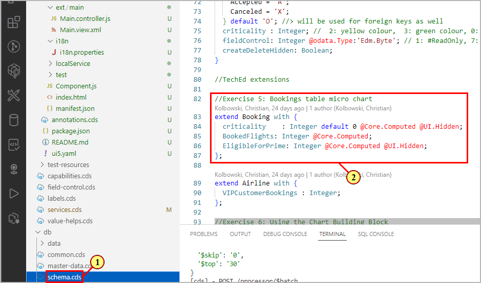

The properties are annotated with **@Core.Computed**. The values are calculated in a read handler implementation for entity **Booking**
in (3) file [/srv/travel-service.js](/srv/travel-service.js#286) , (4) section **Exercise 5: Data for Bookings table micro chart**.

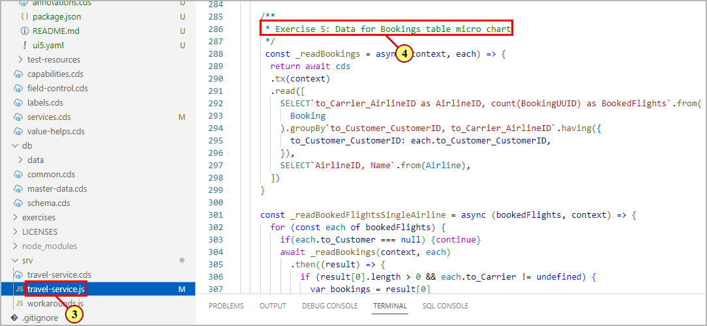

With the optional property **Criticality**, the coloring of the radial chart is defined.\
In order to add a micro chart to a table, you have to define an annotation of type **@UI.DataPoint**. Its mandatory properties are **value** and a **target value**.\
The data point needs to be referenced in the **measure attributes** of annotation **@UI.Chart**.\
Chart type **#Donut** displays a **radial chart**. Properties **Measures** and **MeasureAttributes** are mandatory.

(5) In the Page Map table section click on **Add Columns** .

(6) Select **Add Chart Column**.

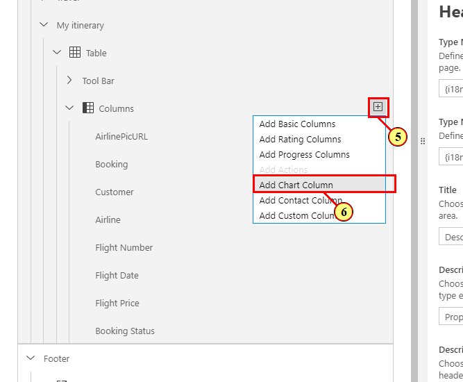

(7) For the **Chart Type**, select **Radial**.

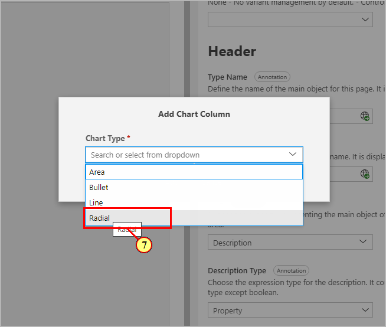

(8) For **Value** select property **BookedFlights**.

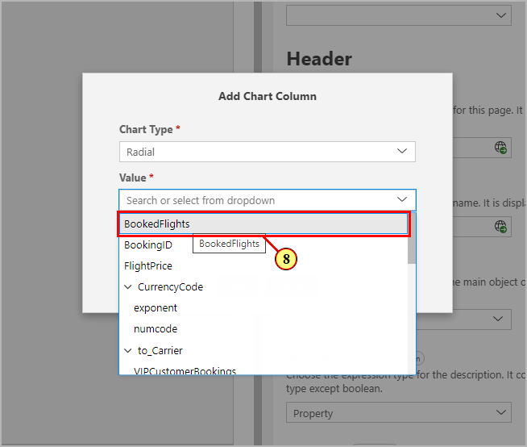

(9) For **Target Value** select **VIPCustomerBookings**.

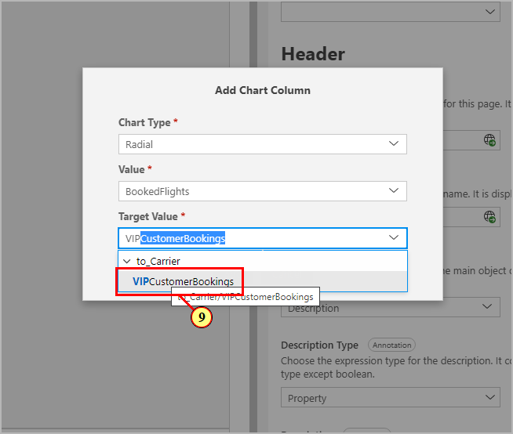

(10) Click 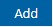.

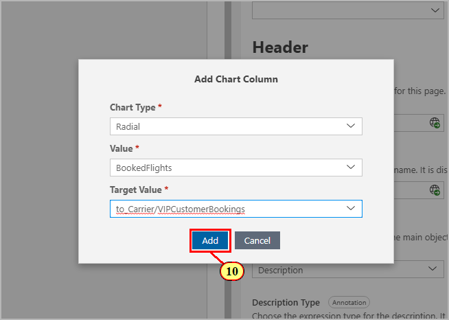

(11) Drag column **BookedFlights** and (12) drop below column **AirlinePicUrl**.

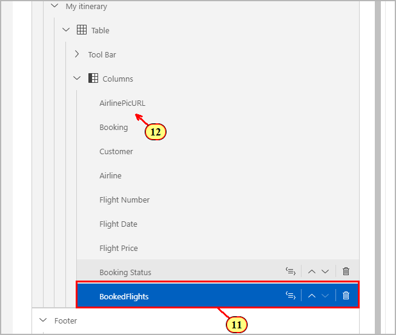

We now define how the color of the chart should be calculated by defining the criticality property.\
(13) In the property pane for chart column **BookedFlights**, open drop-down **Criticality Source** and choose **Property**.

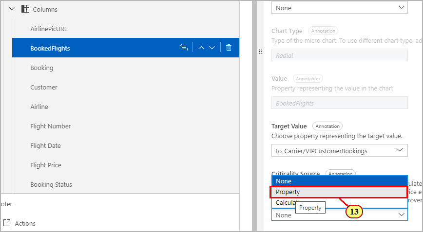

(14) In dialog **Define Property**, select property **EligibleForPrime**.

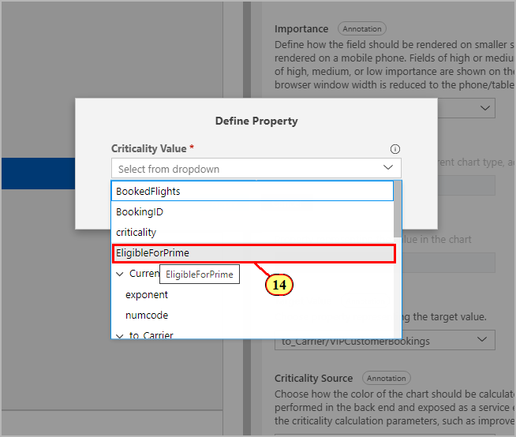

(15) Click .

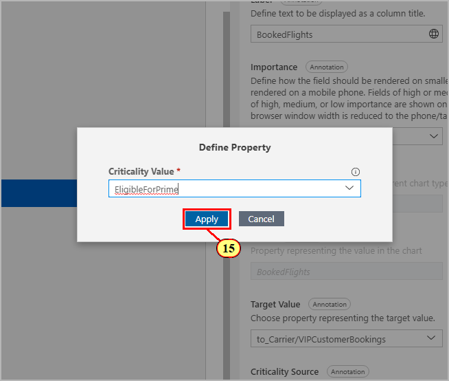

(16) Click table column .

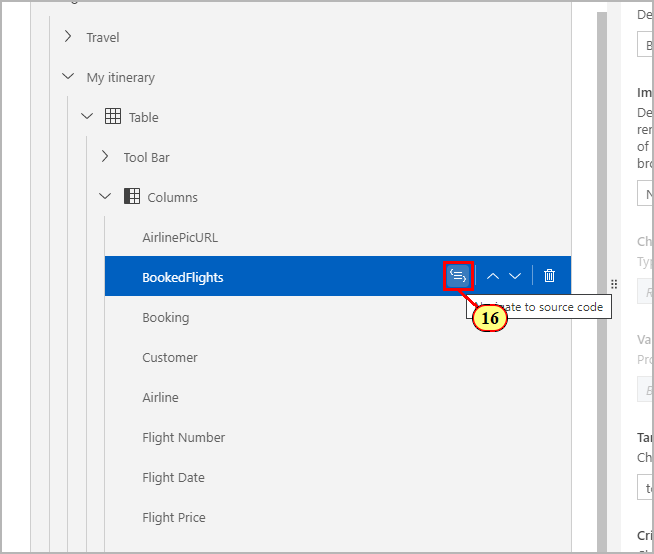

(17) For property **Label** enter **VIP Status** and generate a text key for it by clicking 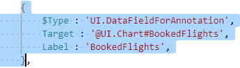.

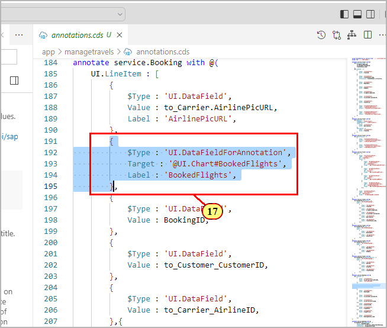

(18) On column **VIP Status** Click **Navigate to source code** 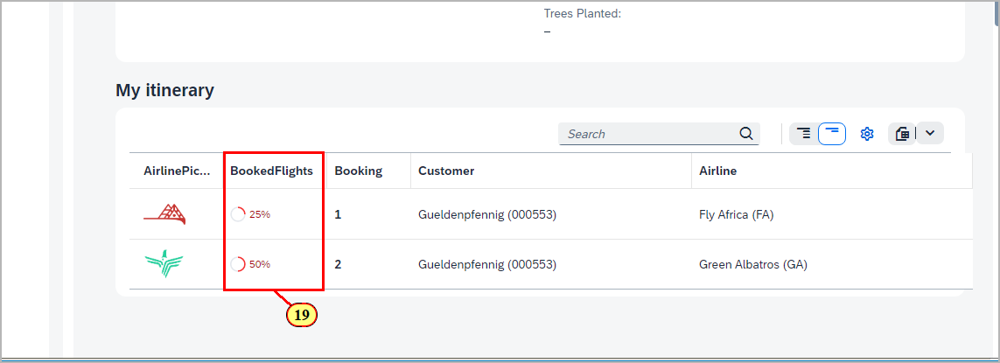.

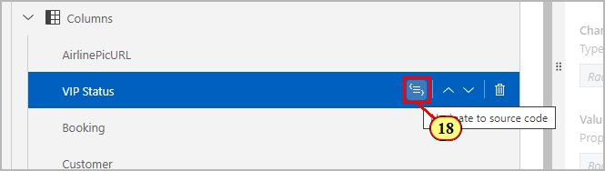

(19) This opens up the corresponding **UI.DataFieldForAnnotation** definition.

 (20) It refers to a **UI.Chart** annotation that was also generated:

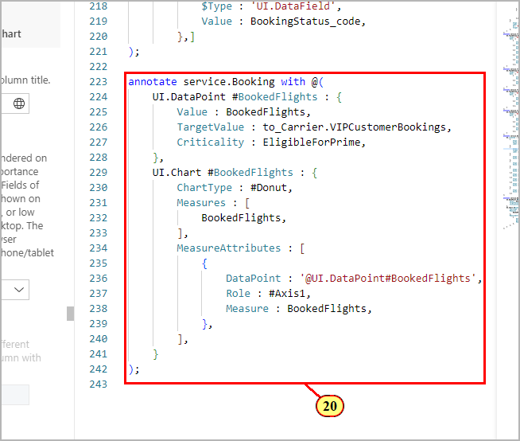

Switch to the preview browser tab.\
(21) On the Object Page, the table now shows the micro chart column.

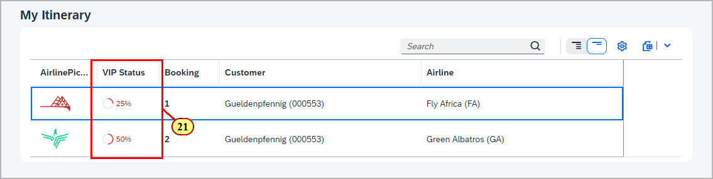

## Summary

You've now successfully added a micro chart column to the table by using the Page Map.

Continue to - [Exercise 6 - Flexible Programming Model: Replace Table Section with a Custom Section](../ex6/README.md)