# Exercise 6 - Flexible Programming Model: Extending the Object Page with a Custom Section and Building Blocks

In this exercise, we will combine UI5 freestyle controls with Fiori elements building blocks in a custom section.\
With the **table building block**, we get the same behaviour and looks of the replaced table section.

## Exercise 6.1 Remove existing Section via Page Map

The **Page Map** provides several ways of configuring the app and also allows to add and remove UI elements.\
\(1\) In the SAP Business Application Studio, click the corresponding tile on the **Application Information** tab.

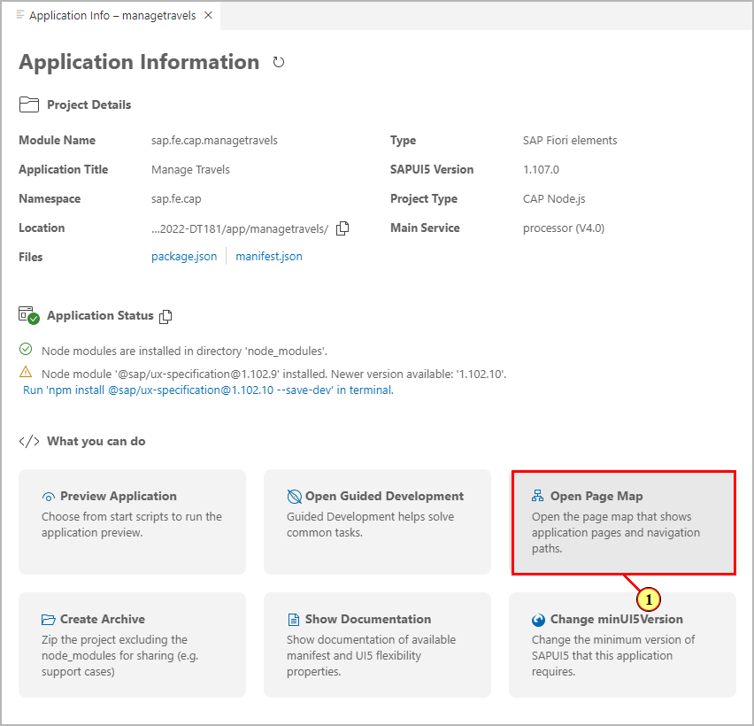

(2) On the Page Map tile **Object Page**, click **Configure Page** .


In the Page Editor for the object page, expand **Sections**. As we want to replace the standard table section with a custom section, let's at first check the
underlying annotation that will be reused with a table building block.\
In section **My Itinerary**, click **Navigate to source code**.

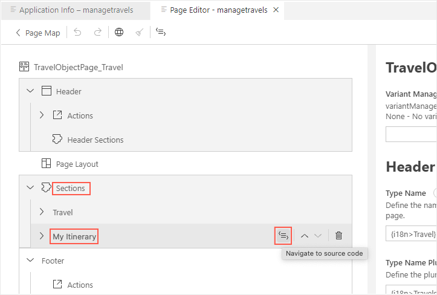

File **app/annotations.cds** is opened. Please note the qualifier of the lineItem annotation which has been set based on the table section description.\
In case you have chosen a differing name, you will have to adopt the table building block metaPath accordingly later.

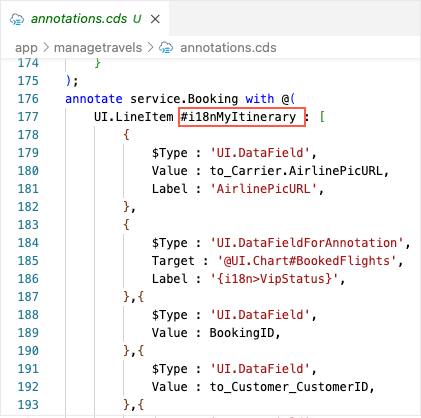

(3) In the Page Editor for the object page delete section **My Itinerary** by clicking .

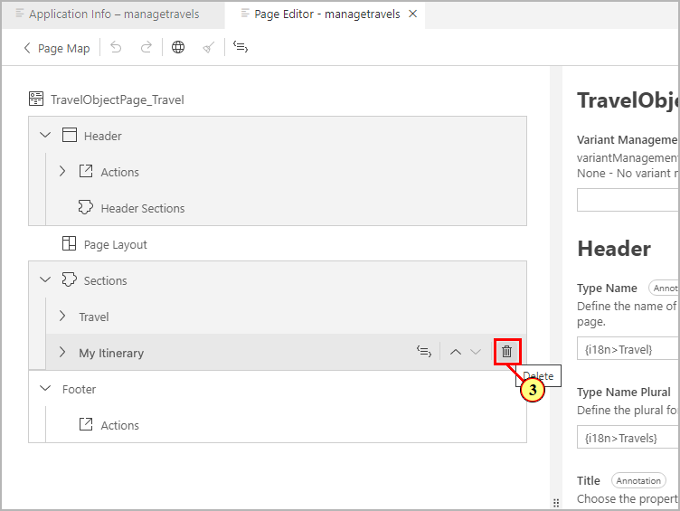

(4) Confirm by clicking 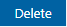.

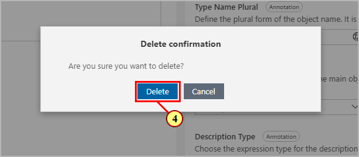

In the preview browser tab of the app, verify that the object page booking table section is not visible anymore.

## Exercise 6.2 Adding a Custom Section via Page Map

(5) In the Page Editor, click   in the top right corner of area **Sections**.

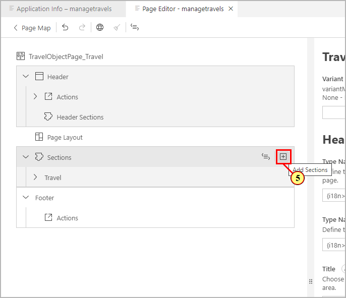

(6) In the combo box, select 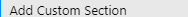.

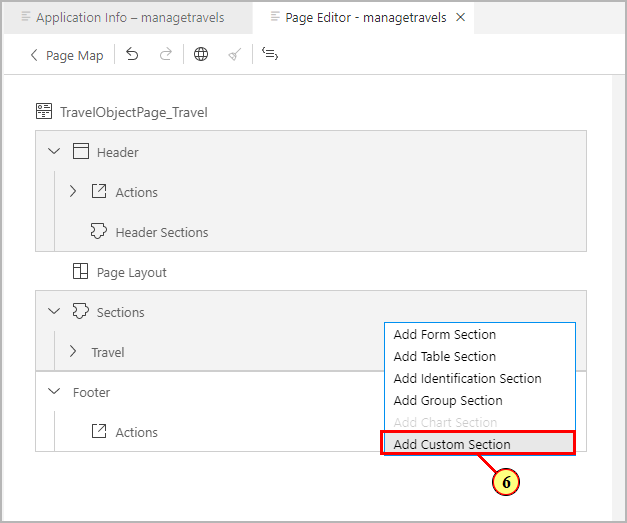

In the dialog **Add Custom Section**, enter **My Itinerary** as title.\
(7) On the right end of the **Title** input field, click icon .

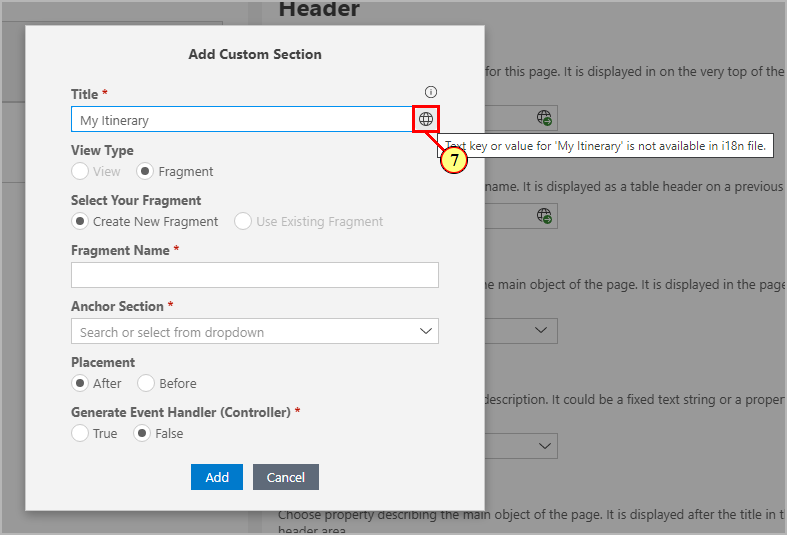

(8) In the dialog, click 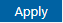.

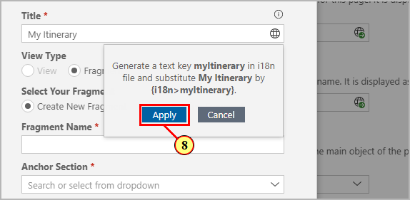

(9) Enter **CustomSection** as Fragment Name.

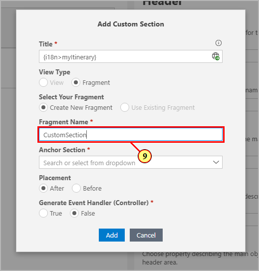

(10) Open the drop-down **Anchor Section**.

(11) Select 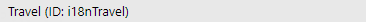.

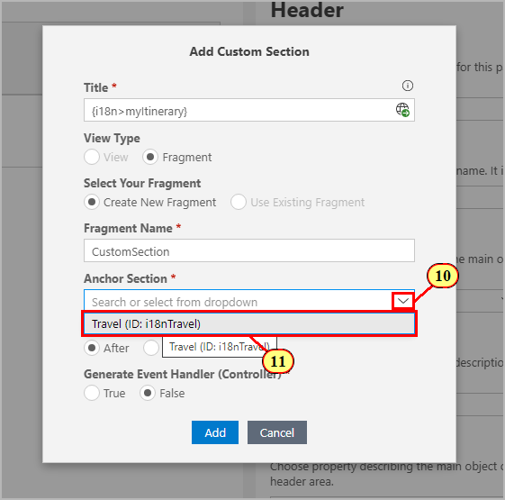

With the Section Position set to **After**, this defines where the custom section should be located on the Object Page.

(12) Set **Generate Event Handler (Controller)** to **true** and confirm dialog by clicking  **Add**.

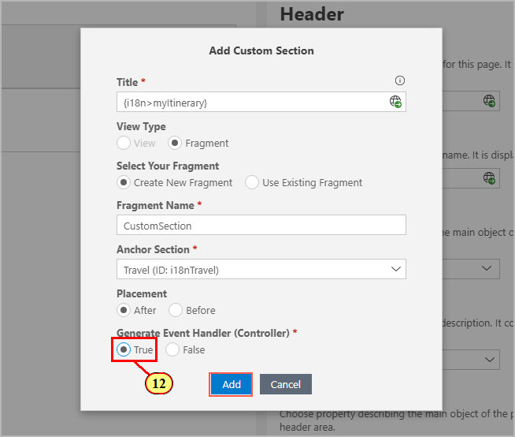

## Exercise 6.3 Replace Generated XML Fragment Content

(13) On section **My Itinerary**, click **Navigate to source code** .

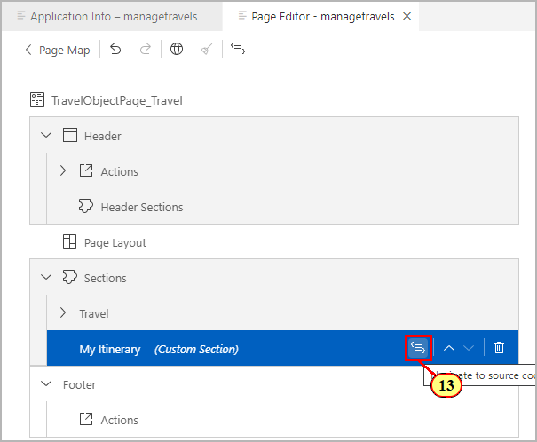

(14) This will open up generated file **CustomSection.fragment.xml**.

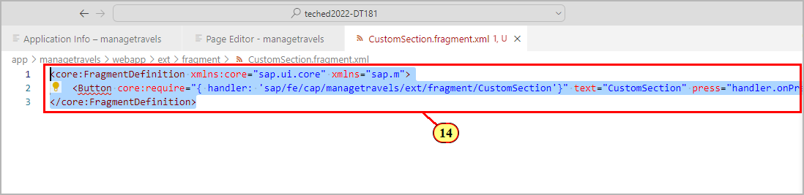

 Replace the content of file **CustomSection.fragment.xml** with the following xml snippet.

 ```js
<core:FragmentDefinition
  xmlns:core='sap.ui.core'
  xmlns='sap.m'
  xmlns:l='sap.ui.layout'
  xmlns:macros='sap.fe.macros'
>
 <VBox core:require="{handler: 'sap/fe/cap/managetravels/ext/fragment/CustomSection'}">  
  <MessageStrip
    text='All bookings for travel {TravelID} got confirmed by the agency.'
    showIcon='true'
    class='sapUiSmallMarginBottom'>
  </MessageStrip>     
  <l:Grid hSpacing='1' containerQuery='true'
    defaultSpan='L12 M12 S12'>
   <l:content>
   <macros:Table metaPath='to_Booking/@com.sap.vocabularies.UI.v1.LineItem#i18nMyItinerary'
      id='bookingTable'/>
   </l:content>
  </l:Grid>
 </VBox>
</core:FragmentDefinition>
```

(15) The xml fragment combines a SAPUI5 MessageStrip control with the building block **Table** from namespace **sap.fe.macros**.\
Only two properties are defined:

- the table control **identifier**
- **metaPath** defining the relative path from the current page's context (entity **Travel**) to the **LineItem** annotation of the associated entity **Booking**.\
   Please double check that the qualifier at the end of property **metaPath** matches the one defined in the lineItem annotation in file **app/annotations.cds**.\
     (in this case **'to_Booking/@com.sap.vocabularies.UI.v1.LineItem#i18nMyItinerary'**).\
   If it differs, please adopt the **metaPath** in the xml code accordingly.

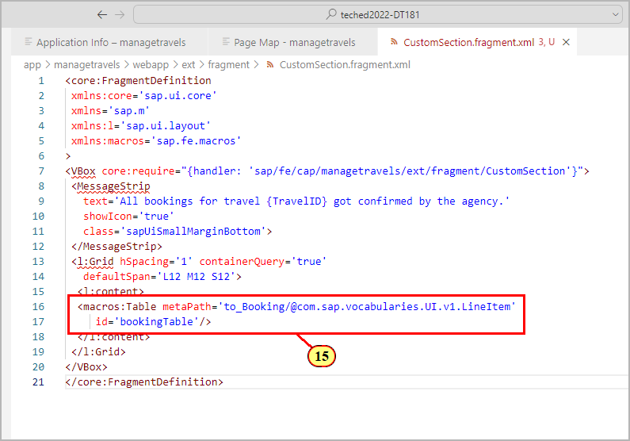

## Exercise 6.4 Testing the Table Building Block

Switch to the preview browser tab of the app.\
The object page now shows the custom section with the message strip control and table building block.\
We will now check whether it behaves exactly as the original booking table from the object page section that was replaced.

(16) Click **Edit** .

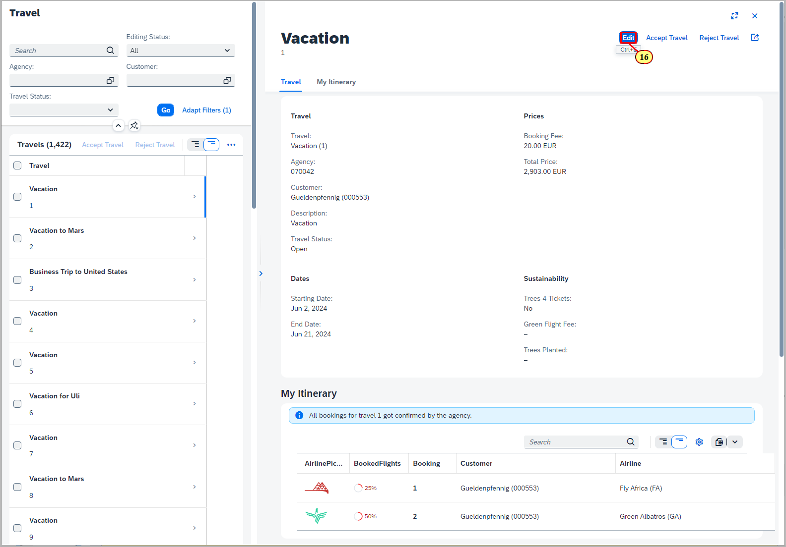

We can see that the table building block follows the edit state of the page.\
Let us check whether the edit flow is also working as expected.\
(17) Open the input help for field **Flight Number** by clicking 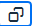.

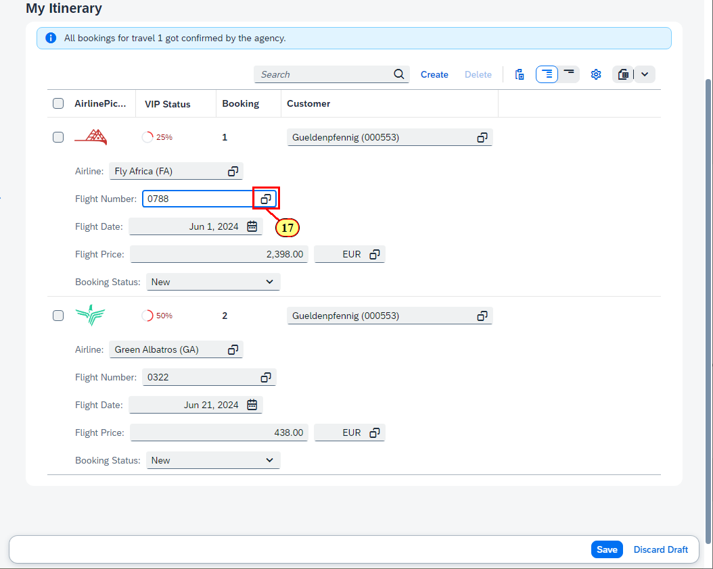

(18) In the Value Help dialog, Select a list entry.


(19) In the footer bar, a notification shows that the draft has been automatically updated.

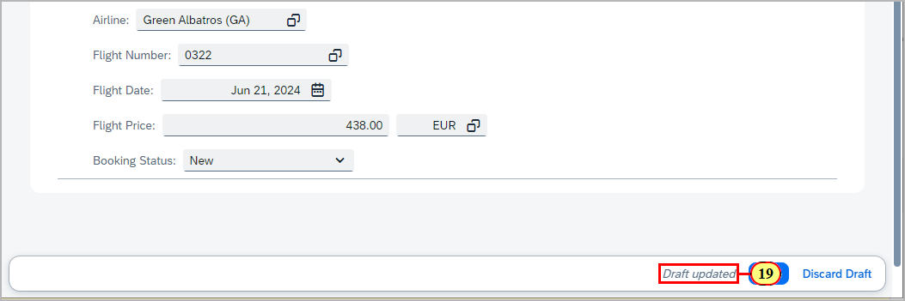

(20) Click .

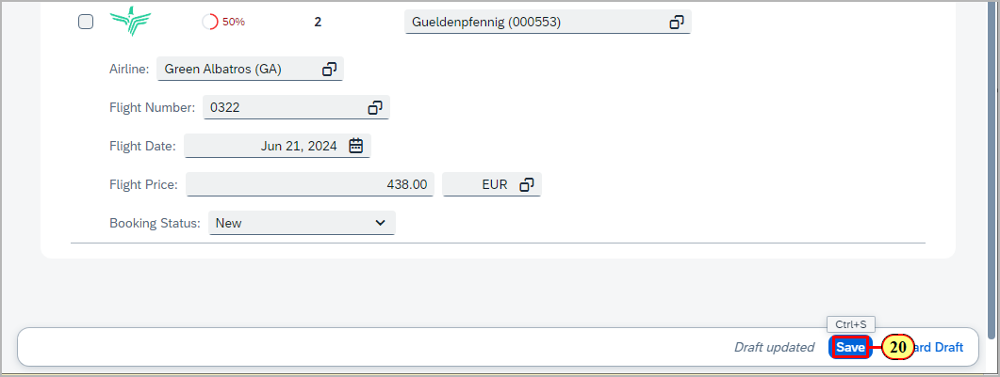

The table switches again to display mode, following the page's edit state.

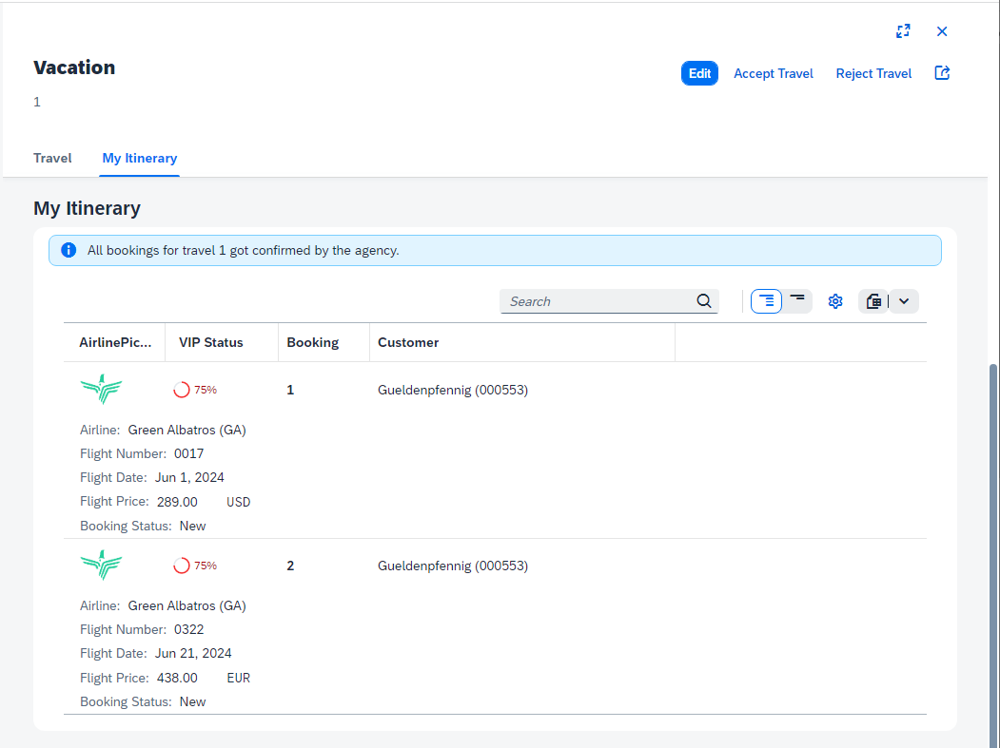

## Summary

You've now successfully replaced the standard table section with a custom section containing the table building block.

Continue to - [Exercise 7 - Guided Development: Adding a Chart Building Block](../ex7/README.md)
